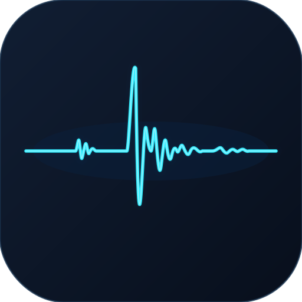

# SeisBox — Seismic Analysis Toolkit

<p align="center">
  
</p>

<p align="center">
  <strong>A modern, native desktop application for seismic data analysis, built with Rust.</strong>
</p>

<p align="center">
  
  
  
  
</p>

---

## 📖 Overview

**SeisBox** is a seismic analysis toolkit designed for researchers and practitioners working with seismological data. It provides an intuitive graphical interface for loading, visualizing, processing, and analyzing seismic waveforms and earthquake catalogs — all within a single, fast, native macOS application.

---

## ✨ Features

| Module | Description |
|---|---|
| **Waveform Viewer** | Load and visualize seismic waveforms in SAC and MiniSEED formats |
| **Phase Picking** | Interactive P- and S-wave phase picking on seismograms |
| **Spectrogram** | Time-frequency analysis of seismic traces |
| **HVSR Analysis** | Horizontal-to-Vertical Spectral Ratio (HVSR) computation with SESAME criteria evaluation |
| **RJ-MCMC Inversion** | Reversible-Jump Markov Chain Monte Carlo inversion for HVSR velocity structure |
| **BVor Analysis** | Bayesian Voronoi spatial analysis for seismicity rate changes |
| **Coulomb Stress** | Coulomb Failure Stress change calculation and optimization using Okada's model |
| **ISC Catalog Search** | Download and filter earthquake catalogs directly from the ISC web interface |
| **FDSN Data Downloader** | Download seismic waveforms via FDSN web services |
| **Spatial Analysis** | Map-based earthquake catalog visualization with cross-section tools |

---

## 🖥️ System Requirements

- **Operating System:** macOS 10.11 (El Capitan) or later
- **Architecture:** Apple Silicon (M1/M2/M3/M4) or Intel x86_64
- **Storage:** ~10 MB for the application

---

## 🚀 Installation

### Option 1: Download the pre-built release (Recommended)

1. Download the latest `SeisBox_macOS.zip` from the [Releases](https://github.com/yudhastyawan/SeisBox/releases) page.
2. Extract the zip file.
3. **Before opening the app for the first time**, double-click `Fix_App_First.command`.
   - A Terminal window will briefly open and close — this removes macOS quarantine restrictions.
4. Double-click `SeisBox.app` to launch.

> **Note:** The `Fix_App_First.command` step is required only once. macOS Gatekeeper blocks unsigned third-party applications by default. Running this script safely removes the quarantine attribute.

### Option 2: Build from source

**Prerequisites:**
- [Rust toolchain](https://rustup.rs/) (1.70+)

```bash
# Clone the repository
git clone git@github.com:yudhastyawan/SeisBox.git
cd SeisBox

# Build and package
chmod +x compile_dist.sh
./compile_dist.sh
```

The compiled application will be in the `dist/` folder.

---

## 📂 Project Structure

```
SeisBox/
├── src/
│   ├── main.rs              # Application entry point
│   ├── app.rs               # Main application state & event loop
│   ├── core/                # Core computation modules
│   │   ├── math_hvsr.rs     # HVSR computation
│   │   ├── rjmcmc.rs        # RJ-MCMC inversion
│   │   ├── cfs_runner.rs    # Coulomb stress computation
│   │   ├── okada_math.rs    # Okada dislocation model
│   │   ├── bvor.rs          # Bayesian Voronoi analysis
│   │   ├── isc_client.rs    # ISC catalog client
│   │   └── ...
│   ├── ui/                  # GUI panel modules (egui-based)
│   │   ├── hvsr_dialog.rs
│   │   ├── inversion_dialog.rs
│   │   ├── cfs_dialog.rs
│   │   ├── spatial_dialog.rs
│   │   └── ...
│   └── libexec/             # Bundled external binaries
│       └── HVf              # HVSR frequency-domain helper
├── assets/                  # Application icons and resources
├── examples/                # Example data files
├── compile_dist.sh          # Build & distribution script
└── Cargo.toml
```

---

## 📄 License

This software is distributed under a **Custom Non-Commercial License**.  
See [LICENSE](LICENSE) for full terms.

In summary:
- ✅ Free to use for **personal and academic / non-commercial** purposes
- ❌ **Commercial use** requires explicit written permission from the author
- ❌ **Redistribution or modification** of the source code is not permitted without permission
- ❌ **Claiming ownership** or substituting this software into another product is not permitted

---

## 👤 Author

**Yudha Styawan**  
[GitHub: @yudhastyawan](https://github.com/yudhastyawan)

---

## 🤝 Contact

For collaboration, licensing inquiries, or bug reports, please open an [issue](https://github.com/yudhastyawan/SeisBox/issues) on GitHub.
