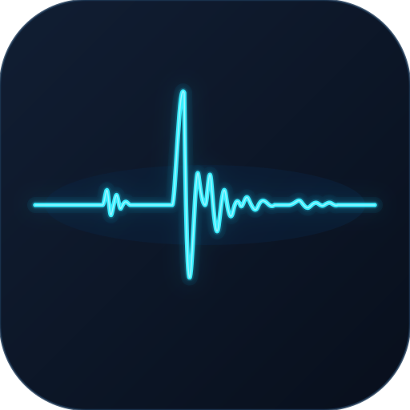

# SeisBox — Seismic Analysis Toolkit

<p align="center">
  
</p>

<p align="center">
  <strong>A modern, native desktop application for seismic data analysis, built with Rust.</strong>
</p>

<p align="center">
  
  
  
  
  
</p>

---

## 📖 Overview

**SeisBox** is a seismic analysis toolkit designed for researchers and practitioners working with seismological data. It provides an intuitive graphical interface for loading, visualizing, processing, and analyzing seismic waveforms and earthquake catalogs — all within a single, fast, native macOS application.

---

## ✨ Features

| Module / App | Description |
|---|---|
| **SeisBox Launcher** | Unified dashboard serving as the entry point to all tools and modules. |
| **Waveform & Picking** | Advanced SAC/MiniSEED waveform visualization, filtering, and interactive P/S phase picking with spectrograms. |
| **HVSR & HVTFA** | Horizontal-to-Vertical Spectral Ratio and Time-Frequency Analysis. Includes STA/LTA filtering, F0/DFA variance rejection, and directional analysis with SESAME criteria. |
| **Inversion** | Multi-algorithm HVSR inversion for velocity structures. Supports Stochastic (RJ-MCMC, PSO, SA) and Deterministic (Levenberg-Marquardt, Occam) methods with monotonicity and layer constraints. |
| **Statistical Analysis** | Earthquake catalog processing: Declustering, FMD (Gutenberg-Richter), b-value & Z-value gridding, Omori's law, and advanced Bayesian Voronoi (BVor) tessellation. |
| **Coulomb Stress (CFS)** | Coulomb Failure Stress change computation on source/receiver faults using Okada's model. Includes cross-sections, map projections, and parameter optimization. |
| **ISC Catalog Client** | Automated search, fetching, and filtering of earthquake catalogs directly from the ISC web database. |
| **FDSN Downloader** | Download seismic waveforms & QuakeML phase arrivals via FDSN. Includes custom provider routing, automated SAC extraction, instrument response removal, and GFZ routing. |
| **Interpolation** | Map-based catalog visualization, cross-section interactive tools, and GIS spatial interpolation utilities. |

---

## 🖥️ System Requirements

- **Operating System:** macOS 10.11 (El Capitan) or later / Windows 10 or later
- **Architecture:** Apple Silicon (M1/M2/M3/M4), Intel x86_64, or Windows x64
- **Storage:** ~10 MB for the application

---

## 🚀 Installation

### Option 1: Download the pre-built release (Recommended)

**For macOS:**
1. Download the latest `SeisBox_macOS.zip` from the [Releases](https://github.com/yudhastyawan/SeisBox/releases) page.
2. Extract the zip file.
3. **Before opening the app for the first time**, double-click `Fix_App_First.command`.
   - A Terminal window will briefly open and close — this removes macOS quarantine restrictions.
4. Double-click `SeisBox.app` to launch.

> **Note:** The `Fix_App_First.command` step is required only once. macOS Gatekeeper blocks unsigned third-party applications by default. Running this script safely removes the quarantine attribute.

**For Windows:**
1. Download the latest `SeisBox_Windows.msi` or `.zip` from the Releases page.
2. Install via the MSI installer or extract and run the executable.

### Option 2: Build from source

**Prerequisites:**
- [Rust toolchain](https://rustup.rs/) (1.70+)

```bash
# Clone the repository
git clone git@github.com:yudhastyawan/SeisBox.git
cd SeisBox

# Build and package
chmod +x compile_dist.sh
./compile_dist.sh
```

The compiled application will be in the `dist/` folder.

---

## 📂 Project Structure

This project uses a Cargo Workspace architecture for modularity:

```
SeisBox/
├── apps/                    # GUI Applications (SeisBox modules)
│   ├── seisbox_hvsr/        # HVSR Analysis & HVTFA
│   ├── seisbox_inversion/   # RJ-MCMC Inversion
│   ├── seisbox_cfs/         # Coulomb Failure Stress (CFS)
│   ├── seisbox_stats/       # BVor, FMD, Z-Value analysis
│   ├── seisbox_fdsn/        # FDSN Downloader
│   ├── seisbox_picker/      # Phase picking
│   ├── seisbox_isc/         # ISC Catalog tools
│   └── seisbox_launcher/    # Main Dashboard / Entry point
├── core/                    # Core library and shared utilities
│   └── seisbox_core/        # Math, parser, IO, and UI abstractions
├── assets/                  # Application icons and resources
├── docs/                    # Static website & tutorials
├── examples/                # Example datasets for tutorials
├── compile_dist.sh          # Build & distribution script for macOS
├── build_msi.bat            # Installer build script for Windows
└── Cargo.toml               # Workspace configuration
```

---

## 📄 License

This software is distributed under a **Custom Non-Commercial License**.  
See [LICENSE](LICENSE) for full terms.

In summary:
- ✅ Free to use for **personal and academic / non-commercial** purposes
- ❌ **Commercial use** requires explicit written permission from the author
- ❌ **Redistribution or modification** of the source code is not permitted without permission
- ❌ **Claiming ownership** or substituting this software into another product is not permitted

---

## 👤 Author

**Yudha Styawan**  
[GitHub: @yudhastyawan](https://github.com/yudhastyawan)

---

## 🤝 Contact

For collaboration, licensing inquiries, or bug reports, please open an [issue](https://github.com/yudhastyawan/SeisBox/issues) on GitHub.
