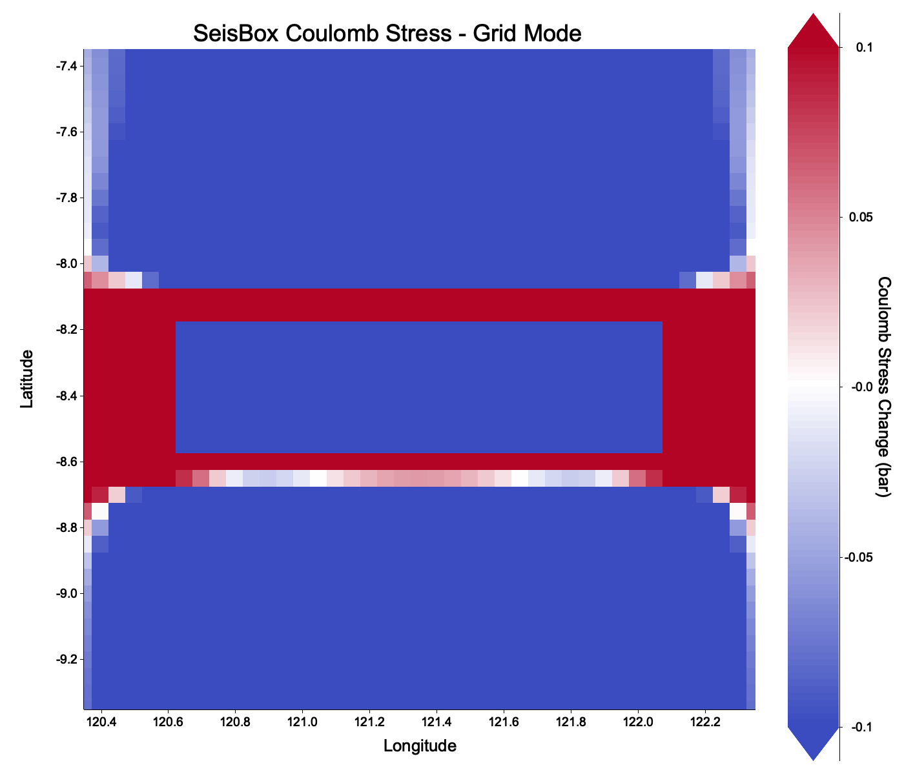
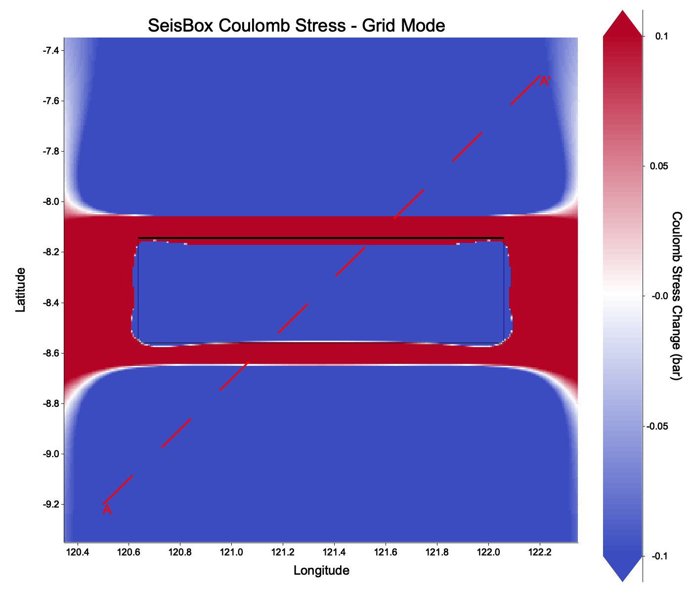
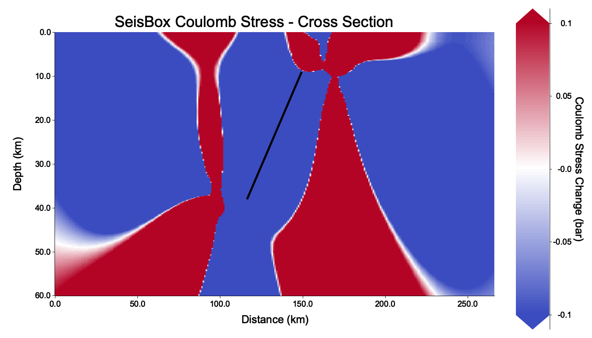
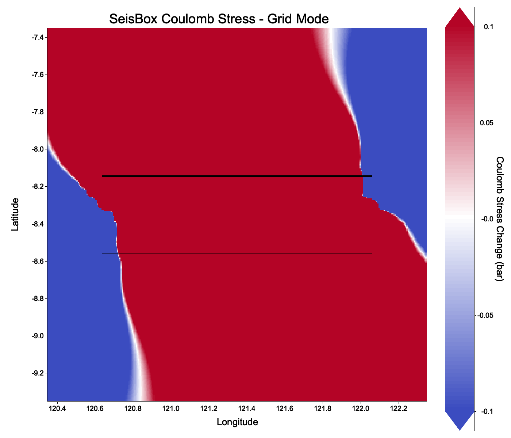
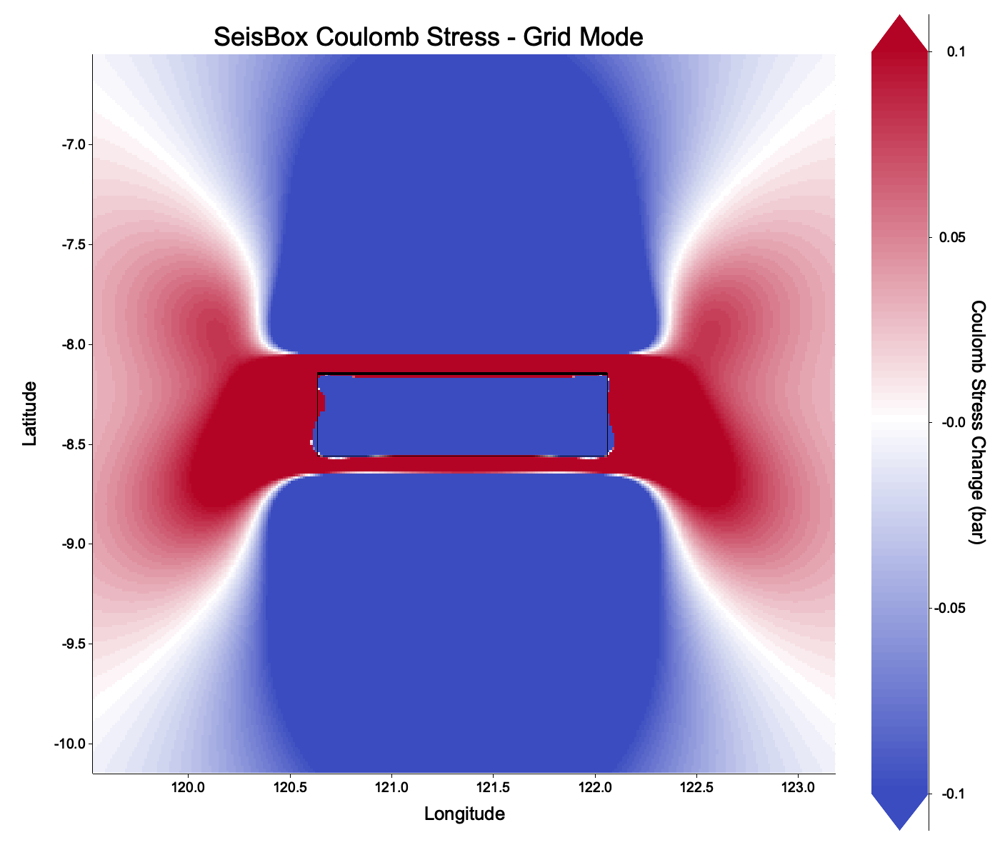
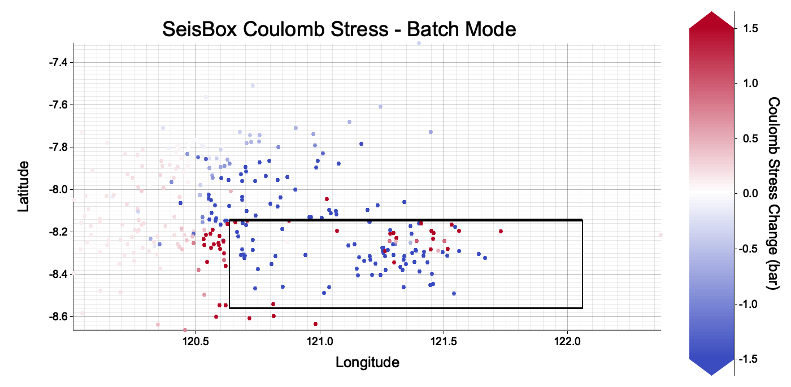
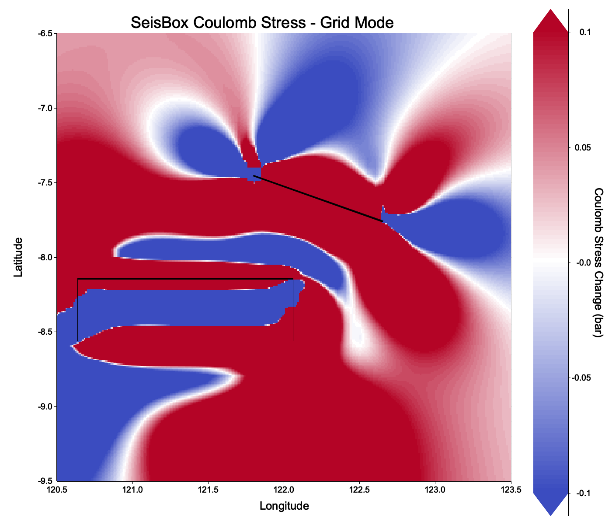
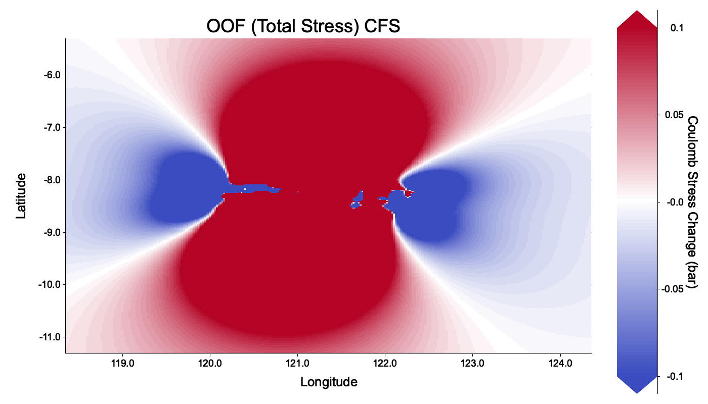
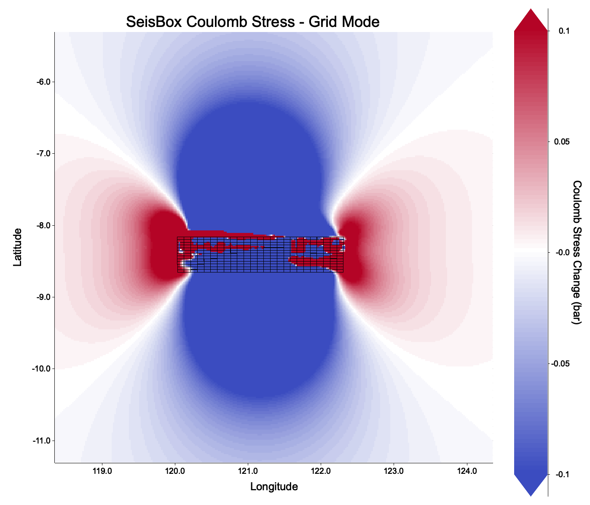

> **KREDIT & DISKLAIMER:**
> Perangkat lunak ini merupakan replika antarmuka baris perintah (CLI) mutakhir yang dirancang khusus untuk mempercepat eksperimen akademis dan otomasi visualisasi. Secara fungsi komputasi, SeisBox secara utuh mereplikasi kalkulasi matematis geomekanika dari piranti lunak legendaris **Coulomb 3.3** yang aslinya dikembangkan oleh Shinji Toda, Ross S. Stein, Volkan Sevilgen, dan Jian Lin (United States Geological Survey/USGS). Pastikan Anda tetap memberikan sitasi ilmiah dan kredit yang selayaknya kepada pembuat asli Coulomb 3.3 apabila menggunakan hasil perhitungan luaran perangkat lunak ini untuk kebutuhan publikasi ilmiah.


## Pengantar Coulomb Failure Stress (CFS)

SeisBox CFS adalah perangkat lunak antarmuka baris perintah (CLI) mutakhir untuk menghitung dan memvisualisasikan transfer tegangan statis Coulomb (*static Coulomb stress transfer*) akibat pergeseran batuan pada patahan gempa bumi. 

Perubahan tegangan (CFS) ini sangat krusial dalam dunia seismologi dan mitigasi bencana. Analisis CFS digunakan secara global untuk mengevaluasi probabilitas area yang rentan terhadap gempa susulan (*aftershock hazard*) maupun memelajari interaksi tektonik kompleks antar sesar (*fault interactions*). Nilai CFS positif (warna merah/hangat) menandakan area yang mengalami peningkatan tegangan (mendekati keruntuhan/gempa), sedangkan nilai negatif (warna biru/dingin) menandakan area yang mengalami relaksasi tegangan (menjauhi keruntuhan).

\begin{mdframed}[backgroundcolor=yellow!15, linecolor=red, linewidth=1.5pt, roundcorner=5pt, innertopmargin=10pt, innerbottommargin=10pt, innerrightmargin=10pt, innerleftmargin=10pt]
\textbf{CATATAN STRUKTUR DIREKTORI \& EKSEKUSI PROGRAM} \vspace{0.5em}

Seluruh perintah (skrip) di dalam tutorial ini ditulis dengan asumsi bahwa program executable, file input (\texttt{.inp}), dan file output (\texttt{.csv}) Anda letakkan di dalam \textbf{satu direktori/folder yang sama}, sehingga Anda bisa memanggilnya langsung dari lokasi tersebut.\vspace{0.5em}

Jika program berada di folder lain, Anda harus memanggil path/alamat lengkapnya (misal: \texttt{/Users/nama/SeisBox\_CLI/seisbox\_cfs}). Begitu juga dengan file input/output-nya.\vspace{0.5em}

\textbf{Peringatan Khusus Pengguna Windows:}\\
Seluruh tata penulisan perintah pada tutorial ini disajikan dengan format sistem operasi UNIX (Linux / macOS). Jika Anda menggunakan Windows (Command Prompt), perhatikan dua aturan krusial berikut:

\begin{enumerate}
    \item Alih-alih mengetik \texttt{./seisbox\_cfs}, Anda harus mengeksekusi program dengan nama \texttt{seisbox\_cfs.exe}
    \item Untuk penulisan perintah yang sangat panjang (di mana kode dipatahkan ke baris baru), tutorial ini menggunakan tanda \textit{backslash} (\textbackslash). Di Windows, Anda wajib mengganti karakter tersebut dengan simbol \textit{caret} (\verb|^|).
\end{enumerate}
\end{mdframed}

---

## 1. Studi Kasus (Parameter Sumber)

Kita akan menyimulasikan transfer tegangan dari sebuah kejadian gempa bumi destruktif bertipe *Thrust* (Sesar Naik) di kawasan Bali-Nusa Tenggara.

**Gempa 1 (Source Fault Utama): Laut Flores 2026**

- **Waktu**: 2026-08-14 21:58:21 (UTC)
- **Lokasi**: 8.351°S, 121.348°E
- **Kedalaman**: 23.5 km
- **Magnitudo**: 7.76 Mw
- **Mekanisme (NP2)**: Strike 90°, Dip 32°, Rake 90°

---

## 2. Pembuatan File Input Patahan (`.inp`)

Algoritma perhitungan tegangan berbasis half-space (seperti Okada) membutuhkan geometri 3D dari area retakan sesar, yang meliputi panjang, lebar, kedalaman *top*, kedalaman *bottom*, serta nilai perpindahan (slip).

Alih-alih memaksa pengguna menghitung semua ini secara manual, SeisBox memiliki fitur kecerdasan turunan yang mampu menghitung parameter geometri secara otomatis berdasarkan Magnitudo menggunakan Hukum Skala Empiris (*Empirical Scaling Law*, Wells & Coppersmith).

### a. Membuat Input untuk Gempa 1 (Laut Flores)

Gunakan perintah `--generate-inp` untuk membuat fail konfigurasi patahan baru (format `.inp`). Parameter mekanismenya harus disuplai (strike, dip, rake, longitude, latitude, kedalaman, dan magnitudo).

```bash
./seisbox_cfs \
    --generate-inp "tutorial_faults.inp" \
    --gen-strike 90.0 \
    --gen-dip 32.0 \
    --gen-rake 90.0 \
    --gen-lon 121.348 \
    --gen-lat -8.351 \
    --gen-depth 23.5 \
    --gen-mag 7.76 \
    --gen-fault-sense rev
```

**Penjelasan Argumen:**

- `--gen-depth 23.5`: Mengatur kedalaman titik tengah (*centroid*) dari patahan (hiposenter) menjadi 23.5 km.
- `--gen-mag 7.76`: Magnitudo momen, digunakan secara internal oleh sistem komputasi SeisBox untuk merumuskan skala luasan patahan.
- `--gen-fault-sense rev`: Memberitahu engine scaling law bahwa jenis sesar ini adalah "Reverse" (Sesar Naik). Ini penting karena persamaan empiris untuk sesar naik, sesar turun (*normal*), dan sesar mendatar (*strike-slip*) berbeda-beda.

*(SeisBox secara otomatis menentukan bahwa patahan patahan ini memiliki Panjang: 156.54 km, Lebar: 54.76 km, dan Slip rata-rata: 1.886 m berdasarkan persamaan empiris).*


### c. Validasi File Input (Health Check)

Sangat direkomendasikan untuk melakukan pengecekan kesehatan komputasi (*sanity check*) terhadap file yang telah dibuat sebelum memulai kalkulasi numerik berat.

```bash
./seisbox_cfs -i "tutorial_faults.inp" --validate
```

Output CLI akan mengonfirmasi bahwa terdapat 1 elemen patahan (*patches*) yang berhasil di-parsing, mengkalkulasi ulang dimensi kotak simulasi yang optimal (rentang spasial X-Y), dan memeriksa modul elastisitas batuan (nilai PR1, E1, FRIC).

---

## 3. Kalkulasi Peta Tegangan 2D (Grid Calculation)

Tahap kalkulasi sesungguhnya adalah memecahkan persamaan *Coulomb Failure Stress* ($\Delta$CFS = $\Delta\tau + \mu'\Delta\sigma$) pada sebuah jaring/kisi observasi (*grid*).

Kita akan mensimulasikan distribusi tegangan pada kedalaman horizontal 20 km (kedalaman yang mewakili zona retakan seismik umum di wilayah busur sunda).

```bash
./seisbox_cfs -i "tutorial_faults.inp" \
    --use-source-mech \
    --grid-lon-inc 0.05 \
    --grid-lat-inc 0.05 \
    --fric 0.4 \
    --depth 20.0 \
    -o "grid_cfs.csv"
```

**Penjelasan Argumen Fisika dan Numerik:**

- `--use-source-mech`: Secara default, perhitungan CFS mengharuskan pendefinisian orientasi patahan "penerima" (*receiver fault*). Dengan menggunakan argumen ini, program akan mengasumsikan patahan penerima memiliki orientasi (strike/dip/rake) yang identik dengan orientasi rata-rata dari gempa sumber.
- `--grid-lon-inc 0.05` & `--grid-lat-inc 0.05`: Menentukan jarak resolusi antar titik komputasi (0.05 derajat setara dengan ~5.5 km). Semakin kecil angkanya, hasil petanya akan semakin detail dan mulus, namun waktu komputasi (CPU Time) akan meningkat secara eksponensial.
- `--fric 0.4`: Nilai Koefisien Friksi Efektif (*Effective Coefficient of Friction*, $\mu'$). Nilai standar dalam analisis geomekanika tektonik umumnya berkisar pada 0.4 hingga 0.8.
- `--depth 20.0`: Memaksa komputasi dilakukan hanya pada bidang horizontal di kedalaman konstan 20 km. Program akan secara otomatis mengubah nama output menjadi `grid_cfs_20.csv` untuk menjaga sistem penamaan manajemen fail Anda.

---

## 4. Evolusi Kustomisasi Visualisasi Peta (Plotting)

Sistem SeisBox dilengkapi dengan sub-modul visualisasi (*Plotting Engine*) berkecepatan tinggi yang ditulis ulang dalam Rust. Sub-modul ini mendukung perenderan spasial resolusi tinggi. 

Di bawah ini, kita akan mendemonstrasikan bagaimana kita bisa mengembangkan visualisasi dari "sangat dasar" menjadi "siap publikasi" (Pub-Ready) dengan penambahan argumen baris perintah secara perlahan.

### Tahap 4a: Plot Skater Dasar (Basic Point Scatter)

Ini adalah bentuk visualisasi paling minimalis. Perintah di bawah ini membaca koordinat CSV dan menaruh nilai tegangan (CFS) dalam bentuk poin/titik di peta 2D, sebagaimana terlihat pada **gambar Plot Dasar** di bawah ini. 

```bash
./seisbox_cfs \
    --plot-csv "grid_cfs_20.csv" \
    --plot-out "assets/grid_step1_basic.png" \
    --plot-aspect-equal
```

{width=65%}

*(Plot di atas masih menampilkan bentuk kasar resolusi grid 0.05 derajat (poin piksel), dan belum ada interpolasi batas spasial antar titik).*

### Tahap 4b: Mengaktifkan Interpolasi Contourf

Untuk visualisasi akademik standar, kita selalu mengharapkan peta warna yang halus dan kontinu. Penambahan flag `--plot-contourf` akan menginstruksikan SeisBox untuk merender peta matriks warna menggunakan algoritma *bilinear upsampling*, yang hasilnya dapat Anda lihat pada **gambar Plot Contourf** berikut.

```bash
./seisbox_cfs \
    --plot-csv "grid_cfs_20.csv" \
    --plot-out "assets/grid_step2_contourf.png" \
    --plot-aspect-equal \
    --plot-contourf
```

{width=65%}

*(Transisi warna merah ke biru kini sangat tajam dan meliuk mengikuti sebaran stres aslinya, membentuk pola kuping (lobe) khas tegangan sesar naik).*

### Tahap 4c: Memproyeksikan Geometri 3D Patahan (Poligon)

Gambar di atas tampak abstrak karena kita tidak tahu di mana tepatnya episenter gempa berada. Untuk itu, kita perlu memproyeksikan tapak (*footprint*) dari patahan sumber kita di atas peta dengan memuat parameter `.inp` kembali menggunakan `--plot-inp <FILE>`. Hasil proyeksinya akan tampak seperti pada **gambar Proyeksi Patahan** di bawah.

```bash
./seisbox_cfs \
    --plot-csv "grid_cfs_20.csv" \
    --plot-out "assets/grid_step3_faults.png" \
    --plot-aspect-equal \
    --plot-contourf \
    --plot-inp "tutorial_faults.inp"
```

{width=65%}

*(SeisBox kini mendatar-proyeksikan bidang sesar 3D menjadi kotak poligon 2D. Garis tebal di satu sisinya mengindikasikan batas atas / top edge dari struktur kemiringan sesar tersebut).*

### Tahap 4d: Modifikasi Kosmetika Patahan (*Fault Styling*)

Secara otomatis, poligon sesar diwarnai hijau solid, yang sayangnya sering bertabrakan warna (*clashing*) dengan nilai *background* Coulomb Stress (biru-merah). Anda bisa mengubahnya menjadi jauh lebih elegan dengan parameter warna `--plot-fault-color`, `--plot-fault-width`, dan `--plot-fault-style` seperti yang dicontohkan pada **gambar Poligon Putus-putus** berikut ini.

```bash
./seisbox_cfs \
    --plot-csv "grid_cfs_20.csv" \
    --plot-out "assets/grid_step4_styled_faults.png" \
    --plot-aspect-equal \
    --plot-contourf \
    --plot-inp "tutorial_faults.inp" \
    --plot-fault-color magenta \
    --plot-fault-width 5 \
    --plot-fault-style dashed
```

{width=65%}

*(Geometri patahan kini jauh lebih mencolok tanpa mendominasi gradien peta tegangan).*

### Tahap 4e: Menambahkan Garis Profil Cross-Section

Untuk keperluan pembuatan jurnal atau laporan, kita kerap menyertakan sayatan vertikal bawah tanah (yang akan didemonstrasikan di Bab 5). Agar pembaca tahu di mana lokasi sayatan tersebut diambil, kita dapat melukiskannya di atas peta grid utama kita menggunakan `--plot-cs-track`. Perhatikan munculnya garis profil tersebut pada **gambar Peta Final** di bawah.

```bash
./seisbox_cfs \
    --plot-csv "grid_cfs_20.csv" \
    --plot-out "assets/grid_step5_cs_track.png" \
    --plot-aspect-equal \
    --plot-contourf \
    --plot-inp "tutorial_faults.inp" \
    --plot-fault-color black \
    --plot-fault-width 3 \
    --plot-cs-track \
    --plot-cs-track-color red \
    --plot-cs-track-style dashed \
    --plot-cs-track-width 4 \
    --cs-start-lon 120.5 \
    --cs-finish-lon 122.2 \
    --cs-start-lat -9.2 \
    --cs-finish-lat -7.5
```

{width=65%}

*(Garis A - A' berwarna merah akan digambar dengan sempurna, menimpa lintasan spasial sayatan sesuai koordinat yang didefinisikan).*

---

## 5. Simulasi Profil Kedalaman (Cross-Section)

Jika Map View melihat Bumi layaknya peta satelit, mode Cross-Section ini layaknya pisau yang memotong sepotong kue. Mode ini memecahkan persamaan tegangan (stress) pada dinding bidang irisan (bidang Jarak Horizontal vs Kedalaman Tanah). 

Kita akan menggunakan koordinat lintasan pemotongan `A` menuju `A'` yang sama persis seperti yang tergambar pada peta merah putus-putus di akhir Bab 4.

### 5a. Komputasi Kalkulasi Numerik Cross-Section

Alih-alih `--grid-lon-inc`, mode ini membutuhkan penentuan resolusi secara linier melintasi jarak (Jarak dalam km, Kedalaman dalam km).

```bash
./seisbox_cfs -i "tutorial_faults.inp" \
    --cross-section \
    --use-source-mech \
    --fric 0.4 \
    --cs-start-lon 120.5 \
    --cs-finish-lon 122.2 \
    --cs-start-lat -9.2 \
    --cs-finish-lat -7.5 \
    --cs-dist-inc 5.0 \
    --depth 0.0 \
    --depth-finish 60.0 \
    --depth-inc 2.0 \
    -o "cross_section.csv"
```

**Penjelasan Modifikasi Argumen:**

- `--cross-section`: Memberitahu sistem bahwa mode yang diinginkan bukan lagi bidang horizontal (*Grid*), melainkan irisan sayatan 2D (*Profile*).
- `--cs-dist-inc 5.0`: Jarak antar piksel spasial di atas permukaan tanah (*along track*) adalah sebesar 5 km.
- `--depth 0.0`, `--depth-finish 60.0`, `--depth-inc 2.0`: Komputasi dimulai dari permukaan (kedalaman 0 km) terus menembus kerak bumi hingga kedalaman 60 km, dengan perhitungan tegangan dilakukan setiap melangkah 2 km.

### 5b. Visualisasi Profil Irisan Dalam Bumi

Saat Anda memplot profil kedalaman 2D menggunakan argumen penambahan fitur `--plot-inp`, SeisBox mengeksekusi **Algoritma Filter Spasial Interseksi Segmen (Segment Intersection Filter)** canggih di belakang layar.

Algoritma tersebut memastikan bahwa meskipun file `.inp` Anda memiliki puluhan data patahan patahan, sistem hanya akan merender segmen kemiringan (*dip segment*) untuk patahan-patahan yang **benar-benar secara fisik dipotong atau bersinggungan** dengan jejak garis `A - A'`.

```bash
./seisbox_cfs \
    --plot-csv "cross_section.csv" \
    --plot-out "assets/cs_final.png" \
    --plot-aspect-equal \
    --plot-contourf \
    --plot-inp "tutorial_faults.inp" \
    --plot-fault-color black \
    --plot-fault-width 4 \
    --cs-start-lon 120.5 \
    --cs-finish-lon 122.2 \
    --cs-start-lat -9.2 \
    --cs-finish-lat -7.5
```

**Hasil Pemodelan Geomekanika Cross-Section Final:**

Hasil pemotongan irisan bawah permukaan ini dapat Anda lihat pada **gambar Cross-Section** di bawah:

{width=65%}

*(Garis diagonal hitam landai adalah jejak kemiringan patahan Gempa Laut Flores M7.76 (Dip 32°). Area merah gelap mengelilingi batas atas patahan menandakan area stres kritis tertinggi pasca pelepasan energi gempa).*

---

## 6. Eksplorasi Fitur Lanjutan (Advanced Features)

Tutorial di atas mencakup penggunaan fitur esensial. Namun SeisBox menyediakan kebebasan modifikasi parameter secara manual untuk kasus geomekanika yang lebih kompleks.

### 6a. Menetapkan Orientasi Patahan Penerima Secara Manual (Custom Receiver Fault)
Secara default, parameter `--use-source-mech` memaksa perhitungan mengevaluasi tegangan pada patahan sesar naik murni (*pure thrust*). Bagaimana jika kita ingin mengetahui apakah gempa Laut Flores ini memicu pergerakan sesar mendatar murni (*pure strike-slip*) di sekitarnya? 

Kita dapat membuang argumen `--use-source-mech` dan menggantinya dengan nilai manual `--strike`, `--dip`, dan `--rake`. Contoh, Sesar Mendatar Utara-Selatan:

```bash
./seisbox_cfs -i "tutorial_faults.inp" \
    --strike 90.0 \
    --dip 90.0 \
    --rake 0.0 \
    --grid-lon-inc 0.05 \
    --grid-lat-inc 0.05 \
    --fric 0.4 \
    --depth 20.0 \
    -o "grid_custom.csv"

# Plotting hasil custom strike-slip (Lihat gambar Custom Strike-Slip di bawah)
./seisbox_cfs --plot-csv "grid_custom_20.csv" --plot-out "assets/grid_custom_plot.png" \
    --plot-aspect-equal --plot-contourf --plot-inp "tutorial_faults.inp"
```

{width=65%}

*(Perhatikan bagaimana pola kuping (lobe) warna merah dan biru berubah drastis karena orientasi patahan target dievaluasi pada mode geser, bukan mode naik).*

### 6b. Memperluas Batas Spasial Grid (Expanded Grid Boundaries)
Secara bawaan, SeisBox akan otomatis mengukur jarak antar patahan paling ujung dan membuat peta yang menutupi pas ukuran kelompok patahan tersebut. Jika Anda ingin melakukan "Zoom-Out" jauh melampaui area patahan, Anda bisa memaksa batas koordinat grid manual menggunakan argumen `start` dan `finish`.

Anda dapat menggunakan satuan jarak kartesian (kilometer dari episenter) dengan argumen `--grid-start-x/y`, atau Anda bisa langsung memotong koordinat geografis absolut menggunakan `--grid-start-lon`, `--grid-finish-lon`, `--grid-start-lat`, dan `--grid-finish-lat`.

Sebagai contoh, kita akan memperluas area hitungan menjadi radius 200 km dari pusat patahan menggunakan sistem kartesian:

```bash
./seisbox_cfs -i "tutorial_faults.inp" \
    --use-source-mech \
    --grid-start-x -200.0 \
    --grid-finish-x 200.0 \
    --grid-start-y -200.0 \
    --grid-finish-y 200.0 \
    --grid-lon-inc 0.05 \
    --grid-lat-inc 0.05 \
    --fric 0.4 \
    --depth 20.0 \
    -o "grid_expanded.csv"

# Plotting hasil grid dengan wilayah luas (Lihat gambar Zoom Out di bawah)
./seisbox_cfs --plot-csv "grid_expanded_20.csv" --plot-out "assets/grid_expanded_plot.png" \
    --plot-aspect-equal --plot-contourf --plot-inp "tutorial_faults.inp"
```

{width=65%}

*(Dengan radius luasan komputasi 200 km dari pusat patahan, Anda bisa melihat distribusi pergeseran tegangan yang lebih makro).*

### 6c. Pengubahan Parameter Elastisitas Bawah Permukaan
Jika Anda mengolah data patahan di kondisi geologi yang sangat keras (contoh zona subduksi di mantel), Anda mungkin perlu merubah parameter modulus elastisitas yang digunakan Okada secara matematis.

- `--young <nilai>`: Mengubah Modulus Young rata-rata batuan (default `800000.0` bar).
- `--poisson <nilai>`: Mengubah Poisson's Ratio rata-rata batuan (default `0.250`). Semakin tinggi Poisson Ratio, semakin banyak tegangan yang dibelokkan ke arah tegak lurus dari gaya kompresi.

---

### 6d. Pembuatan Lintasan Cross-Section Majemuk (Multi-Track)
Terkadang satu sayatan tidak cukup untuk menganalisis suatu area luasan sesar. Anda dapat menyisipkan berapapun jumlah lintasan sayatan dalam satu peta secara paralel menggunakan argumen spasi (spasi berfungsi memisahkan setiap lintasan).

```bash
./seisbox_cfs \
    --plot-csv "grid_cfs_20.csv" \
    --plot-out "assets/multi_track.png" \
    --plot-aspect-equal \
    --plot-contourf \
    --plot-cs-track \
    --cs-start-lon 120.0 121.0 \
    --cs-finish-lon 122.5 123.0 \
    --cs-start-lat -9.5 -8.0 \
    --cs-finish-lat -7.0 -6.5
```
*(Sistem akan menggambar dua garis: A - A' pada koordinat pasangan pertama, dan B - B' pada pasangan kedua).*

### 6e. Komputasi Mode Batch (Receiver Fault Majemuk)
Dalam studi gempa susulan (*aftershocks*), kita seringkali tidak perlu memetakan seluruh *grid* secara membabi buta, melainkan kita hanya ingin menghitung nilai tegangan tepat pada lokasi spesifik gempa susulan (titik 3D hiposenter). SeisBox mendukung mode komputasi massa (*Batch Calculation*) untuk ini.

Anda cukup menyiapkan satu fail CSV yang berisi daftar gempa susulan. Header kolom *wajib* pada SeisBox bernama: `lon, lat, z, strike, dip, rake`. 

Jika Anda mengunduh data langsung dari katalog USGS (misal fail bernama `events.csv`), data tersebut biasanya belum memiliki format yang sesuai. Anda bisa menggunakan sedikit trik *Command Line* Linux/Mac (`awk`) untuk mengekstrak koordinatnya dan mengasumsikan seluruh gempa susulan tersebut memiliki orientasi patahan yang sama dengan gempa utamanya (NP2: Strike 90, Dip 32, Rake 90).

```bash
# Membuat file receiver dari events.csv USGS dengan filter spasial
echo "lon,lat,z,strike,dip,rake" > receivers.csv
tail -n +2 events.csv | \
    awk -F',' '{
        if($3 >= 120.0 && $3 <= 123.0 && $2 >= -9.5 && $2 <= -7.0) 
            print $3","$2","$4",90,32,90"
    }' >> receivers.csv

# Menghitung CFS pada lokasi receiver spesifik di receivers.csv
./seisbox_cfs -i "tutorial_faults.inp" -b "receivers.csv" \
    --fric 0.4 --poisson 0.25 --young 800000.0 \
    -o "batch_output.csv"

# Memplot hasil komputasi Batch (Lihat gambar Mode Batch di bawah)
./seisbox_cfs --plot-csv "batch_output.csv" --plot-out "assets/batch_plot.png" \
    --plot-aspect-equal --plot-inp "tutorial_faults.inp" \
    --plot-vmin -1.5 --plot-vmax 1.5
```

{width=65%}

*(Tiap titik kecil mewakili satu lokasi gempa susulan, diwarnai sesuai dengan besar Coulomb Stress spesifik yang ia terima akibat Gempa Utama. Argumen `--plot-vmin` dan `--plot-vmax` digunakan agar skalanya seragam).*

### 6f. Superposisi Medan Tegangan (Multipel Sesar Sumber)
Karena tegangan di kerak bumi bersifat kumulatif (superposisi linier), kita dapat mensimulasikan gabungan medan tegangan dari banyak patahan utama sekaligus. 

Mari kita asumsikan beberapa tahun sebelumnya, terjadi gempa bumi mendatar (M7.31) yang berdekatan dengan gempa utama kita:

- **Waktu**: 2021-12-14 03:20:23 (UTC)
- **Lokasi**: 7.603°S, 122.227°E
- **Kedalaman**: 17.5 km
- **Magnitudo**: 7.31 Mw
- **Mekanisme**: Strike 290°, Dip 89°, Rake 177° (Strike-Slip)

Gunakan parameter `--append-inp` untuk menyisipkan definisi sesar baru ke fail konfigurasi kita:

```bash
# Duplikasi file agar tutorial sebelumnya tidak tertimpa
cp "tutorial_faults.inp" "tutorial_faults_2.inp"

# Tambahkan sesar Gempa 2021
./seisbox_cfs \
    --append-inp "tutorial_faults_2.inp" \
    --gen-strike 290.0 \
    --gen-dip 89.0 \
    --gen-rake 177.0 \
    --gen-lon 122.227 \
    --gen-lat -7.603 \
    --gen-depth 17.5 \
    --gen-mag 7.31 \
    --gen-fault-sense ss

# Hitung ulang dan Plot petanya! (Lihat gambar Plot Multipel Gempa di bawah)
./seisbox_cfs -i "tutorial_faults_2.inp" \
    --use-source-mech \
    --grid-start-lon 120.5 \
    --grid-finish-lon 123.5 \
    --grid-start-lat -9.5 \
    --grid-finish-lat -6.5 \
    --grid-lon-inc 0.05 \
    --grid-lat-inc 0.05 \
    --fric 0.4 \
    --depth 20.0 \
    -o "grid_cfs_2.csv"

./seisbox_cfs --plot-csv "grid_cfs_2_20.csv" \
    --plot-out "assets/grid_multi_event.png" \
    --plot-aspect-equal \
    --plot-contourf \
    --plot-inp "tutorial_faults_2.inp" \
    --plot-fault-color black \
    --plot-fault-width 3
```

{width=65%}

*(Anda kini melihat dua poligon patahan yang berinteraksi secara geomekanis; memodifikasi wilayah mana yang meredup dan wilayah mana yang membahayakan).*

---

### 6g. Mode Optimally Oriented Fault (OOF)

Dalam geomekanika keruntuhan (Mohr-Coulomb Failure Criterion), patahan tidak terbentuk dengan sembarang orientasi. Jika kita tidak mengetahui geometri patahan penerima secara pasti, kita dapat menggunakan mode **Optimally Oriented Fault (OOF)**. Mode ini akan secara otomatis mencari orientasi bidang sesar (strike, dip, rake) yang paling optimal/rentan untuk runtuh berdasarkan **medan tegangan total** (Regional Stress + Coseismic Stress).

Sebagai contoh, kita akan menggunakan model `ntt-ff.inp`. File dari USGS/NEIC ini telah dilengkapi dengan informasi Regional Stress (`S1DR`, `S1DP`, `S1IN`, dll). SeisBox CFS akan mendeteksi orientasi tegangan regional tersebut secara otomatis dan menghitung OOF.

```bash
# Menghitung OOF dengan membaca Regional Stress dari file INP
./seisbox_cfs -i "ntt-ff.inp" \
    --oof \
    --depth 10.0 \
    -o "oof_result_10.csv"

# Memplot hasil kalkulasi OOF
./seisbox_cfs --plot-csv "oof_result_10.csv" \
    --plot-out "assets/oof_plot.png" \
    --plot-contourf \
    --plot-title "OOF (Total Stress) CFS" \
    --plot-title-size 60
```

{width=65%}

*(Jika nilai Regional Stress tidak tersedia di file `.inp`, atau jika Anda ingin mengujicoba kondisi tektonik yang berbeda, Anda dapat melakukan **override** menggunakan argumen tambahan `--regional-mag`, `--regional-azimuth`, dan `--regional-plunge` saat pemanggilan `--oof`)*.

---

## 7. Ekstra: Kustomisasi Lanjutan dan Kosmetik

### 7a. Geometri Sesar Manual (Mengabaikan *Scaling Laws*)
Jika Anda memiliki data pasti mengenai luasan retakan sesar dari publikasi ilmiah, Anda dapat mengabaikan hukum Wells & Coppersmith dengan memberikan ukuran manual secara eksplisit:

- `--gen-length <km>`: Panjang dimensi patahan (X-axis).
- `--gen-width <km>`: Lebar *down-dip* patahan (Y-axis).
- `--gen-slip <m>`: Nilai pergeseran rata-rata.
- `--gen-top-depth <km>` dan `--gen-bottom-depth <km>`: Alternatif untuk `--gen-depth`.

### 7b. Modifikasi Resolusi dan Teks pada Plotting
- **Judul Peta**: `--plot-title "Stress Transfer Laut Flores"`
- **Ukuran Huruf/Font**: `--plot-title-size 24`, `--plot-label-size 18`, `--plot-tick-size 14`.
- **Dimensi Gambar Output (Piksel)**: `--plot-width 1200` dan `--plot-height 800`.
- **Kerapatan Kontur**: `--plot-contour-steps 20` (membuat transisi diskrit warna pada contourf lebih padat).
- **Rasio Resolusi Upsampling (Bilinear)**: `--plot-upsample-res 500` (mengubah resolusi matriks dasar 300x300 menjadi sangat tajam, membutuhkan RAM dan komputasi ekstra).

### 7c. Opsi Kosmetik Warna (Colorbar)
- **Penguncian Skala Warna Relatif**: `--plot-vmin -1.5`, `--plot-vmax 1.5` (sangat direkomendasikan untuk studi perbandingan agar skala *colorbar* tidak berfluktuasi dari peta ke peta).
- **Pemotongan Ujung Palet Warna**: `--plot-cbar-extend max|both|none` (Membentuk ujung *colorbar* menjadi tajam seperti panah, untuk menajamkan visual anomali nilai ekstrim).
- **Label Colorbar**: `--plot-cbar-label "CFS (Bar)"`, beserta `--plot-cbar-label-size` dan `--plot-cbar-tick-size`.
- **Rasio Aspek Geografis**: Selalu gunakan argumen `--plot-aspect-equal` jika Anda menginginkan peta *Grid* tidak melebar (*distorted*) agar sebaran tegangan terproyeksi proporsional di bumi.

### 7d. Ekspor Format Khusus dan Utilitas Lainnya
Selain visualisasi PNG dan data metrik CSV, SeisBox memiliki argumen tambahan untuk kebutuhan khusus:

- `--tiff`: Menginstruksikan modul perhitungan *Grid* agar turut menyimpan (*export*) hasil komputasi ke dalam format gambar geospasial *GeoTIFF* agar mudah dibaca oleh perangkat lunak SIG (Sistem Informasi Geografis) seperti QGIS dan ArcGIS.
- `--max-depth`: Jika Anda menghitung *Grid* secara 3D pada rentang berbagai macam kedalaman (menggunakan rentang `--depth`, `--depth-finish`, `--depth-inc`), penambahan bendera (*flag*) ini akan menginstruksikan program untuk mencari nilai stres paling kritis (*maksimum absolut*) pada rentang seluruh profil vertikal kedalaman tersebut. Berguna untuk mendeteksi ancaman bahaya ekstrem.
- `--show-info`: Perintah utilitas cepat untuk membaca dan menampilkan parameter rekahan patahan (`strike`, `dip`, `rake`, geometri) yang tersembunyi di dalam fail `*.inp` ke layar terminal, tanpa mengeksekusi perhitungan sama sekali. Berfungsi layaknya bedah anatomi berkas masukan (*file inspection*).

**Contoh Penerapan `--tiff` dan `--max-depth` secara bersamaan:**
```bash
./seisbox_cfs -i "tutorial_faults.inp" \
    --use-source-mech \
    --grid-lon-inc 0.05 --grid-lat-inc 0.05 \
    --depth 5.0 --depth-finish 30.0 --depth-inc 5.0 \
    --max-depth \
    --tiff \
    -o "grid_3d_max_depth.csv"
```
> [!NOTE]
> Perintah di atas akan menghitung stres pada 6 lapisan kedalaman berbeda (5, 10, 15, 20, 25, dan 30 km). Program akan tetap menghasilkan fail terpisah untuk setiap lapisan (misal: `grid_3d_max_depth_5.csv`, `grid_3d_max_depth_10.csv`, dst). Namun berkat kehadiran *flag* `--max-depth`, program juga akan memproduksi satu berkas ekstra dengan akhiran `_max` (yakni `grid_3d_max_depth_max.csv` beserta fail TIFF-nya) yang merupakan hasil pelipatan/pemerasan dari seluruh profil vertikal kedalaman tersebut menjadi satu lapisan 2D yang memuat titik stres maksimum absolut. Sangat praktis untuk analisis bahaya ekstrem!

---

## 8. Studi Kasus Skala Masif: Finite Fault Model (FFM)

Di sepanjang tutorial ini, kita menggunakan patahan ideal/sederhana berbentuk satu lembar papan segi empat yang seragam (*uniform slip*). Dalam kenyataannya, pergeseran energi saat gempa bumi besar tidaklah merata.

Pusat gempa dunia (seperti USGS) seringkali merilis model inversi *Finite Fault*, di mana satu area retakan gempa raksasa dipecah menjadi ratusan kotak (*patches*) kecil yang masing-masing memiliki nilai pergeseran (*slip*), kemiringan (*dip*), dan *rake* yang berbeda-beda untuk merepresentasikan ketidakberaturan sobekan di alam nyata. 

SeisBox sangat dioptimalkan untuk memproses model rumit ini dengan kecepatan hitung yang luar biasa. Jika Anda melihat isi fail `ntt-ff.inp` yang ada di direktori Anda, fail tersebut mendefinisikan 325 *patches* kecil yang mewakili detail sobekan Gempa Bumi skala besar.

**Cara Memproses dan Memvisualisasikan FFM:**

Anda tidak perlu mengubah perintah apapun. Sistem perenderan dan komputasi *Coulomb* SeisBox akan otomatis mengenali ratusan *patches* tersebut dan mengkalkulasi medan tegangannya (*stress field*) secara kolektif:

```bash
# Menghitung CFS untuk 325 patahan sekaligus
./seisbox_cfs -i "ntt-ff.inp" \
    --use-source-mech \
    --grid-lon-inc 0.05 \
    --grid-lat-inc 0.05 \
    --fric 0.4 \
    --depth 10.0 \
    -o "ntt_grid.csv"

# Memvisualisasikan jaringan kompleks FFM (Lihat gambar FFM 325 Segmen di bawah)
./seisbox_cfs \
    --plot-csv "ntt_grid_10.csv" \
    --plot-out "assets/ntt_grid_plot.png" \
    --plot-aspect-equal \
    --plot-contourf \
    --plot-inp "ntt-ff.inp" \
    --plot-fault-color black \
    --plot-fault-width 1
```

{width=70%}

*(Dengan menetapkan ketebalan batas patahan menjadi 1 piksel `--plot-fault-width 1`, kita bisa melihat pola mosaik ratusan segmen patahan yang menyusun model inversi gempa tersebut, beserta sebaran medan tegangannya yang super-kompleks di sekelilingnya!)*

---

## 9. Praktik Terbaik: Menggunakan Skrip Otomatisasi (`.sh` / `.bat`)

Mengingat argumen *Command Line* (CLI) pada SeisBox dapat menjadi sangat panjang, terutama saat Anda mengatur desain kosmetik peta atau berurusan dengan beberapa langkah komputasi sekaligus, mengetik ulang argumen di terminal secara manual sangatlah tidak efisien.

Praktik terbaik yang wajib Anda gunakan adalah dengan menuliskan perintah-perintah tersebut ke dalam sebuah berkas skrip teks yang bisa dieksekusi secara instan.

### Pengguna Linux dan macOS (`.sh`)
Buatlah sebuah berkas teks bernama `run_cfs.sh` dan isi dengan perintah yang dipisahkan karakter garis miring terbalik (`\`) di setiap baris agar mudah dibaca:

```bash
#!/bin/bash
# Ini adalah komentar, tidak akan dieksekusi

# 1. Jalankan Perhitungan Grid
./seisbox_cfs -i "tutorial_faults.inp" \
    --use-source-mech \
    --grid-lon-inc 0.05 \
    --grid-lat-inc 0.05 \
    -o "output_grid.csv"

# 2. Gambar Petanya
./seisbox_cfs --plot-csv "output_grid_10.csv" \
    --plot-out "peta_keren.png" \
    --plot-contourf \
    --plot-aspect-equal
```

Untuk menjalankannya, pertama kali Anda harus memberikan izin eksekusi dari terminal:
```bash
chmod +x run_cfs.sh
./run_cfs.sh
```

### Pengguna Windows (`.bat`)
Buatlah sebuah berkas bernama `run_cfs.bat`. Di lingkungan Windows (Command Prompt), pemisah baris baru menggunakan karakter *caret* (`^`) alih-alih *backslash* (`\`):

```bat
@echo off
REM Ini adalah komentar di Windows

REM 1. Jalankan Perhitungan Grid
seisbox_cfs.exe -i "tutorial_faults.inp" ^
    --use-source-mech ^
    --depth 10.0 ^
    -o "cfs_result.csv"

REM 2. Gambar Petanya
seisbox_cfs.exe --plot-csv "cfs_result.csv" ^
    --plot-out "peta_keren.png" ^
    --plot-contourf ^
    --plot-aspect-equal
```

---


## 10. Lampiran: Menu Bantuan Lengkap (`--help`)

Berikut adalah daftar keseluruhan argumen baris perintah (*Command Line Arguments*) yang didukung oleh SeisBox CFS:

```text
SeisBox CFS Command Line Interface

Author: Yudha Styawan, Geophysical Engineering, Institut Teknologi Sumatera, Indonesia

CREDITS & DISCLAIMER:
This software is a modern CLI replica of the original Coulomb 3.3 software developed by 
Shinji Toda, Ross S. Stein, Volkan Sevilgen, and Jian Lin (USGS). It is developed solely 
for the purpose of facilitating academic research and ease of use. Please cite the original 
Coulomb 3.3 authors when using the underlying mathematical geomechanics models.

BATCH FILE FORMAT:
If using the --batch mode, the file must be a CSV format with a header row.
The header must contain the following columns (case-insensitive):
- Coordinates: 'lon' and 'lat' (degrees) OR 'x' and 'y' (Cartesian km)
- Depth: 'z' (km)
- Mechanism: 'strike', 'dip', 'rake' (degrees)

Example CSV content:
lon,lat,z,strike,dip,rake
127.5,-1.2,10.0,45.0,90.0,0.0


Usage: seisbox_cfs [OPTIONS]

Options:
      --plot-cbar-tick-size <PLOT_CBAR_TICK_SIZE>
          Font size for colorbar ticks

      --plot-fault-color <PLOT_FAULT_COLOR>
          Color of the fault's top edge line (default: black)

      --plot-fault-width <PLOT_FAULT_WIDTH>
          Thickness of the fault's top edge line (default: 4)

      --plot-fault-style <PLOT_FAULT_STYLE>
          Style of the fault's top edge line: 'solid' or 'dashed' (default: solid)

      --plot-cs-track
          Draw the cross-section track line on the map
          (requires --cs-start-lon, --cs-finish-lon, etc.)

      --plot-cs-track-color <PLOT_CS_TRACK_COLOR>
          Color of the cross-section track line (default: black)

      --plot-cs-track-width <PLOT_CS_TRACK_WIDTH>
          Thickness of the cross-section track line (default: 5)

      --plot-cs-track-style <PLOT_CS_TRACK_STYLE>
          Style of the cross-section track line: 'solid' or 'dashed' (default: solid)

  -h, --help
          Print help (see a summary with '-h')

  -V, --version
          Print version

Input / Output (Required):
  -i, --input <INPUT>
          Path to the source earthquake input file (.inp)

  -o, --output <OUTPUT>
          File path to save the output CSV

Batch Mode:
  -b, --batch <BATCH>
          Path to the batch receiver fault file (.csv or .txt)

Information:
      --show-info
          Extract and show the input file information
          (strike, dip, rake, physics, etc) without calculating

      --validate
          Validate the input file to ensure it's readable, complete, and ready for calculation

Generator Mode:
      --generate-inp <GENERATE_INP>
          Generate a new Coulomb INP file

      --append-inp <APPEND_INP>
          Append a new fault to an existing Coulomb INP file

      --gen-strike <GEN_STRIKE>
          Generator fault strike angle (degrees)
          
          [default: 0]

      --gen-dip <GEN_DIP>
          Generator fault dip angle (degrees)
          
          [default: 90]

      --gen-rake <GEN_RAKE>
          Generator fault rake angle (degrees)
          
          [default: 0]

      --gen-length <GEN_LENGTH>
          Generator fault length (km). Defaults to 50.0 or derived from --gen-mag

      --gen-width <GEN_WIDTH>
          Generator fault width (km). Defaults to 20.0 or derived from --gen-mag

      --gen-depth <GEN_DEPTH>
          Generator fault center depth (km)
          
          [default: 10]

      --gen-slip <GEN_SLIP>
          Generator fault slip amount (m). Defaults to 1.0 or derived from --gen-mag

      --gen-mag <GEN_MAG>
          Generator magnitude. If provided, length, width,
          and slip are calculated automatically using empirical relationships

      --gen-fault-sense <GEN_FAULT_SENSE>
          Fault sense for magnitude calculation:
          all, ss (strike-slip), rev (reverse), norm (normal)
          
          [default: all]

      --gen-lon <GEN_LON>
          Generator epicenter longitude (center of the grid)
          
          [default: 0]

      --gen-lat <GEN_LAT>
          Generator epicenter latitude (center of the grid)
          
          [default: 0]

      --gen-grid-size <GEN_GRID_SIZE>
          Grid size limit (radius in degrees) from epicenter
          
          [default: 1]

Standard Grid Mode:
  -s, --strike <STRIKE>
          Receiver fault strike (if not using batch file)
          
          [default: 0]

  -d, --dip <DIP>
          Receiver fault dip (if not using batch file)
          
          [default: 90]

  -r, --rake <RAKE>
          Receiver fault rake (if not using batch file)
          
          [default: 0]

      --depth <DEPTH>
          Depth for calculation (start depth)
          
          [default: 0]

      --depth-finish <DEPTH_FINISH>
          Override finish depth (if specified, calculates multiple depths)

      --depth-inc <DEPTH_INC>
          Override depth increment

      --use-source-mech
          Use the source fault mechanism (average strike, dip, rake
          from INP) for the receiver fault

Grid Bounds Overrides (Optional):
      --grid-start-x <GRID_START_X>
          Override grid start X

      --grid-finish-x <GRID_FINISH_X>
          Override grid finish X

      --grid-start-y <GRID_START_Y>
          Override grid start Y

      --grid-finish-y <GRID_FINISH_Y>
          Override grid finish Y

      --grid-x-inc <GRID_X_INC>
          Override grid X increment

      --grid-y-inc <GRID_Y_INC>
          Override grid Y increment

      --grid-start-lon <GRID_START_LON>
          Override grid start Longitude

      --grid-finish-lon <GRID_FINISH_LON>
          Override grid finish Longitude

      --grid-start-lat <GRID_START_LAT>
          Override grid start Latitude

      --grid-finish-lat <GRID_FINISH_LAT>
          Override grid finish Latitude

      --grid-lon-inc <GRID_LON_INC>
          Override grid Longitude increment (degrees)

      --grid-lat-inc <GRID_LAT_INC>
          Override grid Latitude increment (degrees)

Physical Parameter Overrides (Optional):
      --fric <FRIC>
          Override Friction Coefficient (FRIC)

      --poisson <POISSON>
          Override Poisson's Ratio (PR1/PR2)

      --young <YOUNG>
          Override Young's Modulus (E1/E2)

Optimally Oriented Fault (OOF):
      --oof
          Enable Optimally Oriented Fault (OOF) mode. Receiver fault geometry is 
          determined from the total stress field (regional tectonic stress + 
          coseismic perturbation) using Mohr-Coulomb failure theory. Requires 
          regional stress parameters (from INP file or --regional-* overrides)

      --regional-mag <REGIONAL_MAG>
          Override regional stress magnitude σ₁−σ₃ (bar)

      --regional-azimuth <REGIONAL_AZIMUTH>
          Override regional stress σ₁ azimuth (degrees CW from North)

      --regional-plunge <REGIONAL_PLUNGE>
          Override regional stress σ₁ plunge (degrees downward from horizontal)

Output Options:
      --tiff
          Output a TIFF raster image along with the CSV (Grid mode only)

      --max-depth
          Save the maximum Coulomb stress across all depth layers (Grid mode only)

Cross Section Mode:
      --cross-section
          Enable cross-section calculation mode

      --cs-start-lon <CS_START_LON>...
          Cross-section start longitude (degrees)

      --cs-finish-lon <CS_FINISH_LON>...
          Cross-section finish longitude (degrees)

      --cs-start-lat <CS_START_LAT>...
          Cross-section start latitude (degrees)

      --cs-finish-lat <CS_FINISH_LAT>...
          Cross-section finish latitude (degrees)

      --cs-dist-inc <CS_DIST_INC>
          Distance increment for cross-section (km)
          
          [default: 2]

Plotting Engine:
      --plot-csv <PLOT_CSV>
          Read an existing CSV output file and plot it directly to PNG

      --plot-out <PLOT_OUT>
          Specific output PNG file path for the plot

      --plot-aspect-equal
          Force aspect ratio to 1:1 for the plot

      --plot-contourf
          Enable smooth contour plotting (contourf) instead of blocky pcolormesh

Plotting Engine Options:
      --plot-inp <PLOT_INP>
          Overlay faults from an INP file onto the plot

      --plot-vmin <PLOT_VMIN>
          Override minimum value for colormap (vmin) (default: auto calculated from data)

      --plot-vmax <PLOT_VMAX>
          Override maximum value for colormap (vmax) (default: auto calculated from data)

      --plot-title <PLOT_TITLE>
          Set a custom title for the plot (default: dynamic based on mode)

      --plot-width <PLOT_WIDTH>
          Set custom output image width (default: 1200)

      --plot-height <PLOT_HEIGHT>
          Set custom output image height (default: 800)

      --plot-contour-steps <PLOT_CONTOUR_STEPS>
          Set the number of color contour steps (default: 50)

      --plot-upsample-res <PLOT_UPSAMPLE_RES>
          Set the upsampling resolution for contourf (default: 300)

      --plot-title-size <PLOT_TITLE_SIZE>
          Set font size for the plot title (default: 45)

      --plot-label-size <PLOT_LABEL_SIZE>
          Set font size for the axis labels (default: 32)

      --plot-tick-size <PLOT_TICK_SIZE>
          Set font size for the axis ticks (default: 24)

      --plot-x-labels <PLOT_X_LABELS>
          Set the maximum number of x-axis tick labels (default: 10)

      --plot-y-labels <PLOT_Y_LABELS>
          Set the maximum number of y-axis tick labels (default: 10)

      --plot-cbar-label <PLOT_CBAR_LABEL>
          Set custom title for the colorbar (default: Coulomb Stress Change (bar))

      --plot-cbar-label-size <PLOT_CBAR_LABEL_SIZE>
          Set custom font size for the colorbar title (default: follows --plot-label-size)

      --plot-cbar-y-labels <PLOT_CBAR_Y_LABELS>
          Y-axis labels count for colorbar tick labels (default: 10)

      --plot-cbar-extend <PLOT_CBAR_EXTEND>
          Set colorbar extend arrows (none, min, max, both) (default: both)

EXAMPLES:

1. Generate a new INP file from manual coordinates:
   seisbox_cfs --generate-inp file_baru.inp --gen-strike 45.0 --gen-dip 80.0 \
      --gen-rake 90.0 --gen-lon 128.0 --gen-lat -1.0 --gen-mag 7.2 \
      --gen-fault-sense ss

2. Validate an existing INP file before running calculations:
   seisbox_cfs -i fault.inp --validate

3. Calculate Standard Grid with specific depths and output to CSV:
   seisbox_cfs -i fault.inp --use-source-mech --depth 10.0 \
      --depth-finish 15.0 --depth-inc 5.0 -o output.csv

4. Calculate using a Batch file of receiver faults:
   seisbox_cfs -i fault.inp -b receivers.csv -o batch_output.csv

5. Calculate Optimally Oriented Fault (OOF) using regional stress:
   seisbox_cfs -i fault.inp --oof --tiff --depth 10.0 -o oof.csv

6. Calculate Cross-Section profiling:
   seisbox_cfs -i fault.inp --cross-section --use-source-mech \
      --cs-start-lon 127.0 --cs-finish-lon 130.0 \
      --cs-start-lat -2.0 --cs-finish-lat 1.0 -o cross_section.csv

7. Generate a custom high-resolution plot from a CSV file:
   seisbox_cfs --plot-csv output.csv --plot-contourf --plot-width 1920 \
      --plot-height 1080 --plot-title "My Custom Plot" \
      --plot-title-size 60 --plot-cbar-extend both

```
