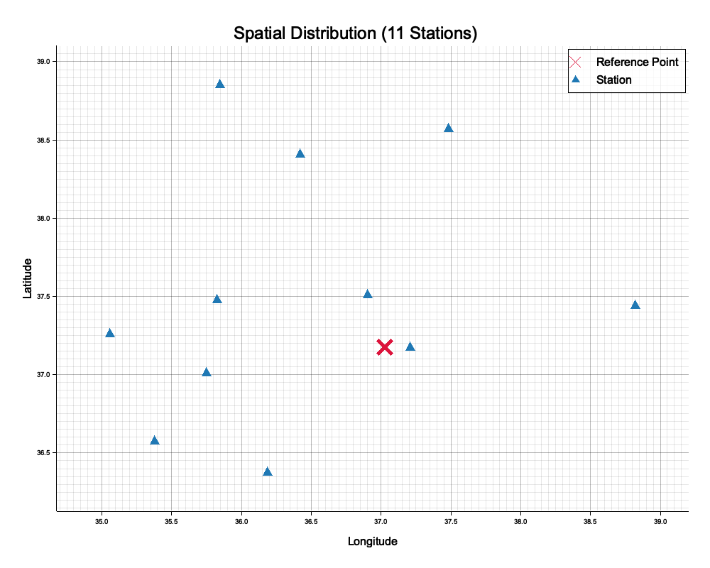

# 1. Pendahuluan
**SeisBox FDSN** adalah utilitas dari *suite* SeisPick yang dirancang khusus untuk mempermudah proses pencarian dan pengunduhan rekaman data seismik (gelombang *waveform*) dari *International Federation of Digital Seismograph Networks* (FDSN). Modul ini bekerja dengan metode asinkron *multi-threading* sehingga memungkinkan Anda untuk mencari data ke 25 peladen jaringan FDSN global secara paralel dan mendownloadnya secara masif.

Tutorial ini akan memandu Anda dalam menggunakan antarmuka baris perintah (CLI) `seisbox_fdsn`. Sebagai studi kasus, kita akan mengambil data seismik rekaman gempa bumi besar yang melanda wilayah **Kahramanmaraş, Turki** pada tanggal 6 Februari 2023.

---

# 2. Studi Kasus: Gempa Turki (M7.8)
Gempa bumi mematikan berkekuatan M7.8 melanda Turki bagian selatan pada pagi hari tanggal 6 Februari 2023. 
Berdasarkan katalog kegempaan (USGS/EMSC), parameter gempa tersebut adalah:
* **Waktu Kejadian**: 2023-02-06 01:17:35 UTC
* **Episenter**: Lintang 37.174, Bujur 37.032
* **Magnitudo**: Mw 7.8

Kita akan menggunakan `seisbox_fdsn` untuk mengunduh stasiun seismik milik Kandilli Observatory and Earthquake Research Institute (**KOERI**), yang merupakan peladen utama untuk jaringan kegempaan Turki, dalam radius 2 derajat dari episenter.

---

# 3. Langkah-Langkah Pengunduhan

Buka terminal (*command line*), arahkan pada direktori utama SeisPick, lalu jalankan perintah berikut:

```bash
seisbox_fdsn \
  --providers KOERI \
  --lat 37.174 \
  --lon 37.032 \
  --min-radius 0 --max-radius 2.0 \
  --ref-time "2023-02-06 01:17:35" \
  --start-offset -60 \
  --end-offset 300 \
  --channel "HHZ,BHZ" \
  --plot-map fdsn_turkey_map.png
```

### Penjelasan Parameter:
- `--providers KOERI`: Menargetkan pencarian stasiun spesifik pada server KOERI. Anda juga bisa mengisi `ALL` jika ingin melakukan *broadcasting* ke seluruh FDSN Datacenters, namun untuk mempercepat proses tutorial kita membatasinya pada KOERI.
- `--lat` dan `--lon`: Titik episenter gempa Kahramanmaraş.
- `--min-radius` dan `--max-radius`: Radius pencarian stasiun (dalam derajat). Kita membatasi pencarian dari 0 hingga 2 derajat.
- `--ref-time`: Waktu referensi/kejadian gempa (dalam format `YYYY-MM-DD HH:MM:SS`).
- `--start-offset` dan `--end-offset`: Batas jendela pemotongan data relatif terhadap `--ref-time` dalam detik. `-60` berarti kita meminta potongan 1 menit sebelum gempa, dan `300` berarti 5 menit setelah gempa.
- `--channel`: Kode komponen saluran instrumen (*channel*). `HHZ,BHZ` meminta *High Broadband* (100 Hz) vertikal, atau *Broadband* (50 Hz). Anda juga dapat menggunakan tanda koma untuk mengunduh banyak saluran (contoh: `HHZ,HHN,HHE`), atau menggunakan tanda bintang / *wildcard* (contoh: `HH*`) untuk meminta seluruh instrumen *Broadband*.
- `--plot-map`: Mencetak secara otomatis peta spasial distribusi episenter gempa terhadap stasiun penerima yang diunduh ke dalam file citra.
- `--export-sac`: (Opsional) Mengonversi seluruh rekaman *MiniSEED* yang diunduh ke dalam format `SAC` secara otomatis.
- `--download-arrivals`: (Opsional) Mengunduh waktu tiba (*phase arrivals*) berbasis format *QuakeML* yang langsung dikonversi menjadi tabel `CSV` lokal.

---

# 4. Membaca Hasil Pencarian

Setelah Anda mengeksekusi skrip di atas, Anda akan melihat tampilan log pada terminal seperti ini:

```text
SeisBox FDSN Downloader (CLI Mode)
====================================
Selected Providers:
  - KOERI: http://eida.koeri.boun.edu.tr
Search area: Lat 37.174, Lon 37.032, Radius 0 - 2 deg
Time range: 2023-02-06 01:16:35 to 2023-02-06 01:22:35
Channel: BHZ
Output dir: ./fdsn_data

1. Searching for stations...
[Search] Fetching stations from KOERI...
Found 11 matching stations.
Generating Spatial Map in fdsn_turkey_map.png ...
  -> Saved: fdsn_turkey_map.png

3. Downloading Waveforms (MiniSEED)...
[mseed] Downloading 1/11 from KOERI (KO BNN)...
[mseed] Downloading 2/11 from KOERI (KO CEYT)...
[mseed] Downloading 3/11 from KOERI (KO DARE)...
...
```

Dalam studi kasus ini, aplikasi menemukan **11 stasiun** dalam jaringan KOERI yang memenuhi kriteria pencarian kita. 

### Analisis Peta Spasial (Spatial Map)
Perintah `--plot-map` menghasilkan gambar peta 2D yang menggambarkan distribusi spasial stasiun seismik di sekitar titik pusat gempa. Tanda silang merah mewakili episenter (titik acuan `--lat` dan `--lon`), sedangkan penanda segitiga kuning mewakili lokasi stasiun-stasiun pencatat (KOERI) yang diunduh.



### Penyimpanan Berkas Waveform (MiniSEED)
Berkas *waveform* dalam format standar seismologi, yaitu **MiniSEED** (ekstensi `.mseed`), akan secara otomatis disimpan di direktori `fdsn_data/`. Anda dapat memproses data MiniSEED ini lebih lanjut di perangkat lunak seperti SeisPick, ObsPy, atau SeisComP untuk kepentingan riset seperti relokasi hiposenter, penentuan fokal mekanisme, atau koreksi kecepatan geser.

---

# 5. Fitur Pencarian Tingkat Lanjut (Advanced Filtering)

Jika Anda ingin lebih spesifik lagi mencari stasiun dari *network* tertentu saja, `seisbox_fdsn` menyediakan filter presisi `network` dan `station`:

```bash
seisbox_fdsn --providers ALL --lat 37.174 --lon 37.032 \
  --ref-time "2023-02-06 01:17:35" --start-offset -60 --end-offset 300 \
  --network KO --station CEYT
```

Pada contoh di atas:
- Meskipun menggunakan parameter `--providers ALL` untuk mencari paralel ke semua 25 FDSN di seluruh dunia, aplikasi memfilter secara spesifik hanya data stasiun yang berasal dari instrumen kode `CEYT` pada jaringan `KO` (KOERI).
- Proses asinkronisasi *multi-threading* yang ditanamkan dalam aplikasi `seisbox_fdsn` akan memastikan pencarian ke seluruh puluhan peladen FDSN ini selesai hanya dalam hitungan detik.

### Menggunakan FDSN Kustom (Custom FDSN Node)
Apabila jaringan FDSN yang Anda tuju belum terdaftar pada basis data SeisBox, Anda bisa secara langsung menuliskan spesifikasi URI penyedia (*Custom Provider*) pada `--providers` dengan format `NAMA:URI`, seperti berikut:

```bash
seisbox_fdsn --providers "AUSPASS:http://auspass.edu.au,MYNODE:http://192.168.1.1:8080" \
  --channel "HH*" --export-sac
```

Pada contoh di atas, SeisBox akan menghubungi `auspass.edu.au` dan juga server kustom pada `192.168.1.1:8080`. Karena digabungkan dengan `--channel HH*` dan `--export-sac`, seluruh data multi-komponen akan diunduh secara pararel dan setiap *channel* di dalamnya (misal Z, N, dan E) akan diekstrak menjadi file SAC (`.sac`) yang saling terpisah.

**Contoh Output Terminal Saat Menjalankan Wildcard & Ekspor SAC:**
```text
3. Downloading Waveforms (MiniSEED)...
[mseed OK] KO.TAHT -> ./fdsn_test_koeri2/KO.TAHT.HHALL.mseed
[mseed OK] KO.SARI -> ./fdsn_test_koeri2/KO.SARI.HHALL.mseed
[mseed OK] KO.DARE -> ./fdsn_test_koeri2/KO.DARE.HHALL.mseed
...
All tasks completed successfully.
```

**Hasil File di Direktori Output:**
Bisa dilihat di bawah ini, setiap satu file *MiniSEED* berekstensi `.HHALL.mseed` (gabungan Z, N, E dari FDSN) telah sukses dipisah dan dikonversi dengan nama *channel* aslinya dalam format biner SAC (`.sac`):
```text
KO.DARE.HHALL.mseed
KO.DARE.HHE.sac
KO.DARE.HHN.sac
KO.DARE.HHZ.sac
KO.TAHT.HHALL.mseed
KO.TAHT.HHE.sac
KO.TAHT.HHN.sac
KO.TAHT.HHZ.sac
...
```

### Mengunduh Waktu Tiba Gelombang (Phase Arrivals) dari QuakeML
Selain data seismogram, `seisbox_fdsn` juga mendukung pengunduhan katalog gempa beserta waktu tiba (*phase arrivals*) langsung dari *endpoint* FDSN. Fitur ini sangat berguna jika Anda ingin mendapatkan data *ground truth* (misalnya dari jaringan GFZ/GEOFON) tanpa harus menggunakan format CSV konvensional.

Untuk melakukan hal ini, tambahkan *flag* `--download-events`, `--download-arrivals`, serta batas parameter magnitudo misalnya `--min-mag 7.0` ke dalam argumen Anda.

### Mengunduh Metadata & Respon Instrumen (StationXML)
Anda juga dapat menyertakan argumen `--download-xml` agar FDSN Downloader secara otomatis menarik *metadata* setiap stasiun beserta seluruh *poles* dan *zeros* respons instrumennya dalam format StationXML (`.xml`).

```bash
seisbox_fdsn --providers "GFZ:http://geofon.gfz-potsdam.de" \
  --lat 37.174 --lon 37.032 \
  --min-radius 0 --max-radius 5.0 \
  --start-time "2023-02-06 00:00:00" --end-time "2023-02-06 23:59:59" \
  --channel "HH*" \
  --min-mag 7.0 \
  --download-events --download-arrivals \
  --download-xml \
  --out-dir ./fdsn_data_gfz
```

**Contoh Output Terminal Saat Mengunduh Event dan XML:**
```text
[Events] Downloading event catalog...
[Event] Fetching events from GFZ...
[Event OK] Saved catalog to ./fdsn_data_gfz/gfz_arrivals.csv

1. Searching for stations...
[Search] Fetching stations from GFZ...
Found 37 matching stations.

2. Downloading StationXML...
[XML] Downloading StationXML 1/37 from GFZ (1O BI01)...
[XML] Downloading StationXML 2/37 from GFZ (1O BI02)...
[XML OK] 1O.BI01 -> ./fdsn_data_gfz/1O.BI01.HHALL.xml
[XML OK] 1O.BI02 -> ./fdsn_data_gfz/1O.BI02.HHALL.xml
...
```

Data `gfz_arrivals.csv` yang dihasilkan secara otomatis mem-parsing format struktur XML dari *QuakeML* menjadi tabel relasional *flat* yang mudah dibaca oleh SeisPick maupun Pandas. Sedangkan direktori keluaran Anda sekarang akan berisi data mseed, `.sac`, dan juga metadata respon `.xml`.
