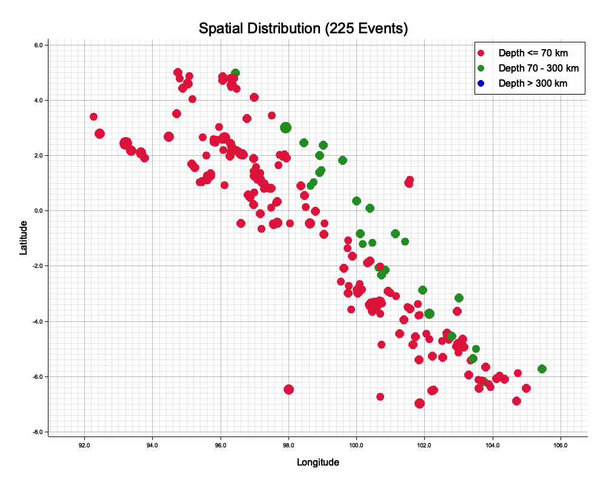
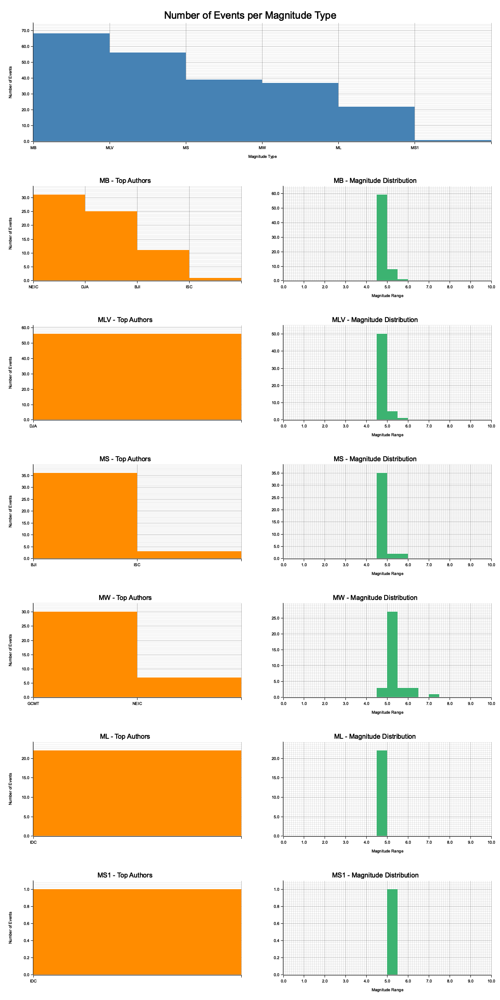
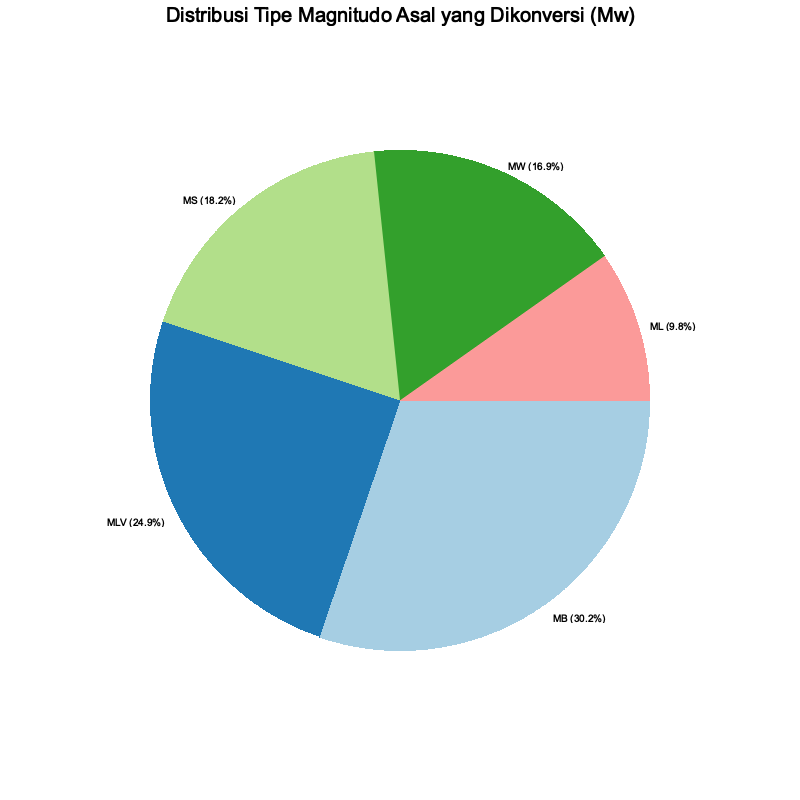
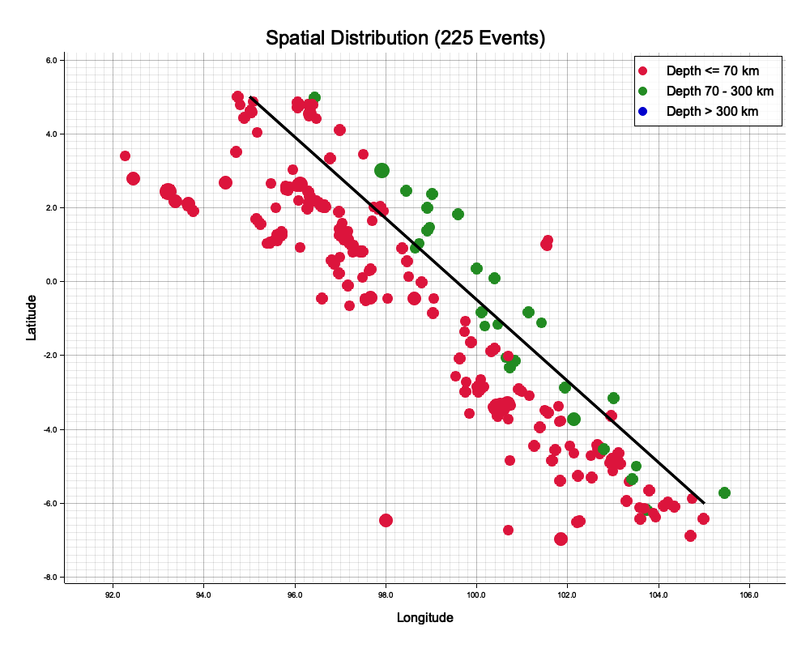
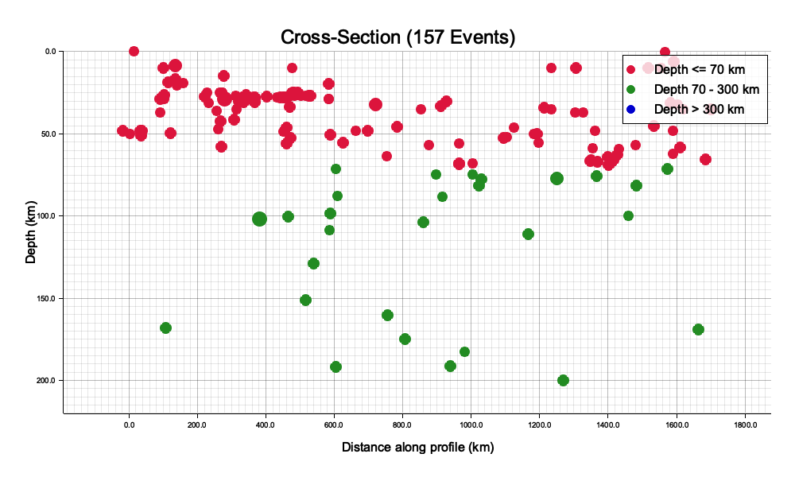

> **KREDIT & DISKLAIMER:**
> Perangkat lunak ini merupakan antarmuka baris perintah (CLI) untuk mengakses dan memproses katalog gempa bumi secara otomatis dari basis data **International Seismological Centre (ISC)**. Pastikan Anda tetap memberikan sitasi ilmiah yang selayaknya kepada ISC Bulletin sesuai dengan standar publikasi apabila menggunakan data luaran dari perangkat lunak ini untuk kebutuhan publikasi ilmiah.

## Pengantar SeisBox ISC

SeisBox ISC adalah fitur CLI yang memungkinkan Anda melakukan pengunduhan data secara _batch_ tanpa batas dari basis data ISC, mengonversi magnitudo menggunakan aturan konversi lokal Anda (misal, menyeragamkan ke Moment Magnitude / Mw), memfilter data secara spasial (sayatan melintang / cross-section), serta mengekspor data yang sudah diproses secara otomatis ke dalam bentuk grafik visual yang apik dan siap untuk dipublikasi.

\begin{mdframed}[backgroundcolor=yellow!15, linecolor=red, linewidth=1.5pt, roundcorner=5pt, innertopmargin=10pt, innerbottommargin=10pt, innerrightmargin=10pt, innerleftmargin=10pt]
\textbf{CATATAN EKSEKUSI PROGRAM} \vspace{0.5em}

Bagi pengguna Windows, jika Anda menggunakan Command Prompt, harap ganti karakter backslash (\textbackslash) di panduan ini dengan simbol caret (\verb|^|). Selain itu, pastikan untuk menggunakan \texttt{seisbox\_isc.exe} ketimbang \texttt{./seisbox\_isc}.
\end{mdframed}

---

## 1. Unduh Data Gempa (Fetching)

Langkah awal dalam menggunakan `seisbox_isc` adalah mengunduh data langsung dari ISC. Anda harus mendefinisikan batasan spasial (*bounding box*) dan batasan waktu (*time range*).

```bash
./seisbox_isc \
    --min-lon=95.0 --max-lon=105.0 \
    --min-lat=-7.0 --max-lat=6.0 \
    --start-date="2010-01-01" --start-time="00:00:00" \
    --end-date="2020-12-31" --end-time="23:59:59" \
    --min-depth=0.0 --max-depth=300.0 \
    --min-mag=4.5 --max-mag=9.0 \
    --output "katalog_sumatera_processed.csv" \
    --raw-output "raw_isc.txt"
```

**Penjelasan Singkat:**

- Rentang Waktu dan Lokasi: Mencakup area Sumatera selama 1 dekade.
- Kedalaman dan Magnitudo: Membatasi hanya gempa menengah hingga kuat (M > 4.5) hingga kedalaman 300 km.
- `--raw-output`: Menyimpan hasil balasan (_response_) asli dari server ISC tanpa modifikasi.
- `--output`: File CSV hasil pemrosesan dan ekstraksi SeisBox.

---

## 2. Menyeragamkan Magnitudo (Konversi)

Seringkali data dari ISC memiliki berbagai jenis magnitudo (Mb, Ms, ML, dll.). Kita dapat menyeragamkan jenis magnitudo tersebut menjadi **Mw** (Moment Magnitude) menggunakan algoritma konversi berbasis regresi linear yang disediakan via `--conversion-file`.

```bash
./seisbox_isc \
    --input-raw "raw_isc.txt" \
    --conversion-file "aturan_konversi.csv" \
    --output "katalog_sumatera_seragam.csv"
```

> [!TIP]
> **Kerja Offline:** Perintah di atas menggunakan `--input-raw`. Ini berarti `seisbox_isc` **tidak akan mengunduh ulang** data dari internet, melainkan memproses data teks `raw_isc.txt` yang sebelumnya sudah diunduh. Sangat berguna untuk penghematan kuota API dan percepatan kalkulasi. Anda juga bisa menggunakan `--input-csv` jika sebelumnya menyimpan hasil unduhannya ke `.csv`.

---

## 3. Visualisasi Peta dan Statistik

Anda bisa langsung membuat infografik berupa Peta Sebaran Episentrum Gempa, Histogram Distribusi Magnitudo-Waktu, dan Pie Chart dominasi Magnitudo dengan cara menambahkan argumen pemplotan visual.

```bash
./seisbox_isc \
    --input-raw "raw_isc.txt" \
    --plot-map "peta_sebaran.png" \
    --plot-stats "output_direktori_grafik"
```

Dengan perintah ini, di dalam folder tujuan Anda akan tercipta gambar-gambar siap pakai (resolusi tinggi) yang sangat cocok disematkan pada laporan akademis. 

**Contoh pewarnaan pada peta episentrum:**

- **Merah**: 0 - 70 km (Gempa Dangkal)
- **Hijau**: 70 - 300 km (Gempa Menengah)
- **Biru**: > 300 km (Gempa Dalam)







---

## 4. Pembuatan Sayatan Melintang (Cross-Section)

Jika Anda ingin melihat aktivitas penunjaman (subduksi) tektonik secara penampang kedalaman, SeisBox memiliki modul otomatis untuk memproyeksikan episentrum 3D menjadi koordinat jarak relatif 2D. 

```bash
./seisbox_isc \
    --input-raw "raw_isc.txt" \
    --cs-start-lon=100.0 --cs-start-lat=-2.0 \
    --cs-end-lon=105.0 --cs-end-lat=-3.0 \
    --cs-buffer-km=50.0 \
    --cs-out-csv "cross_section_data.csv" \
    --plot-cross-section "cross_section_plot.png" \
    --plot-map "peta_sebaran_cs.png" \
    --plot-cs-track
```

**Penjelasan Parameter Sayatan:**

- `--cs-start-*` & `--cs-end-*`: Titik koordinat awal dan titik akhir garis sayatan melintang. Titik awal akan dihitung sebagai "titik 0 km" di sumbu horizontal.
- `--cs-buffer-km 50.0`: **Lebar Penampang (Buffer)**. Karena garis hanyalah 1 dimensi, kita harus menetapkan margin (lebar jangkauan) agar gempa di sekitar garis bisa dilibatkan. Semua gempa dengan jarak ortogonal melebihi `50 km` dari garis utama akan dibuang (tidak ditampilkan di plot).
- `--cs-out-csv`: Menghasilkan CSV berisi seluruh kejadian gempa yang lolos penyaringan sayatan ini. CSV tersebut memiliki 2 buah kolom tambahan yang krusial untuk plot spasial tingkat lanjut:
  1. `along_track_km`: Jarak sejajar kejadian gempa pada garis sayatan (sumbu X di plot).
  2. `cross_track_km`: Jarak tegak lurus (simpangan) kejadian gempa ke garis (lebar absolut).
- `--plot-cross-section`: Mencetak otomatis grafik scatter 2D yang sumbu-X nya merepresentasikan `along_track_km` dan sumbu Y yang terinversi (dari 0 ke bawah) merepresentasikan `Kedalaman (Depth)`.
- `--plot-cs-track`: Menggambar garis sayatan melintang tersebut secara visual di dalam `--plot-map`.





---

## 5. Ringkasan

SeisBox CLI menjamin otomatisasi penuh, dari mulai pengunduhan hingga menghasilkan infografik *cross-section* berkualitas tinggi hanya dari satu atau dua baris terminal shell, sangat memfasilitasi kebutuhan analitik dan *data processing pipeline* yang masif di laboratorium.
