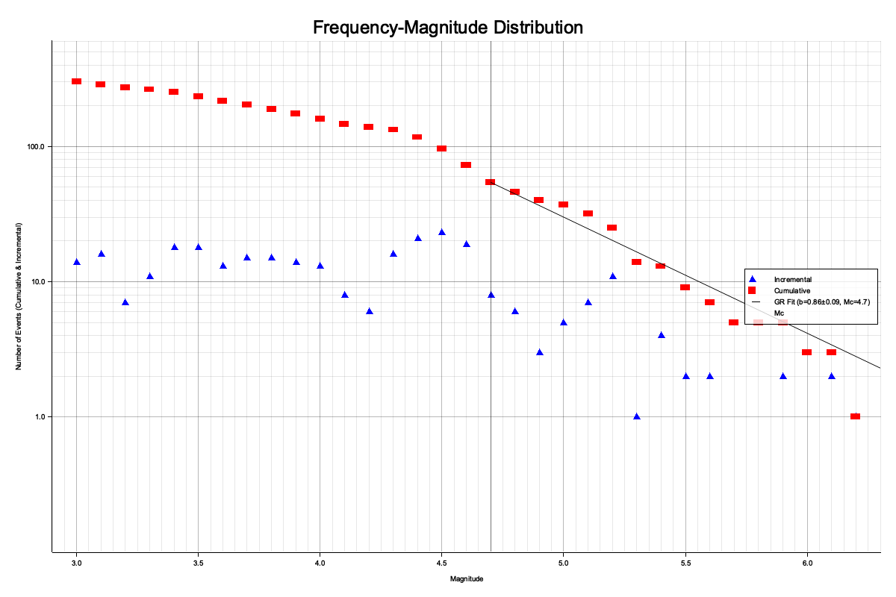
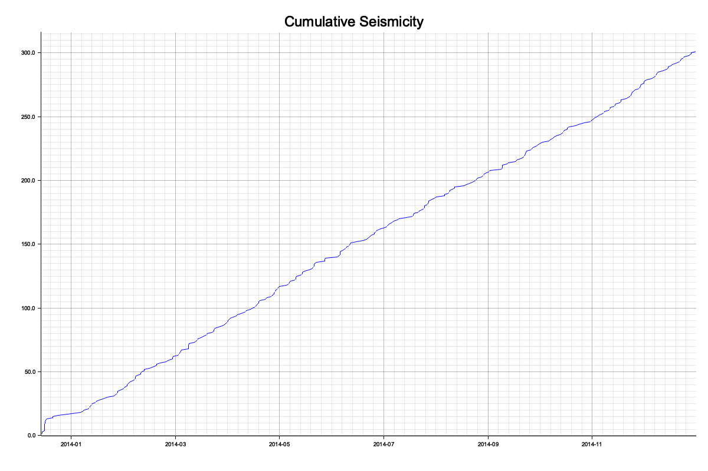
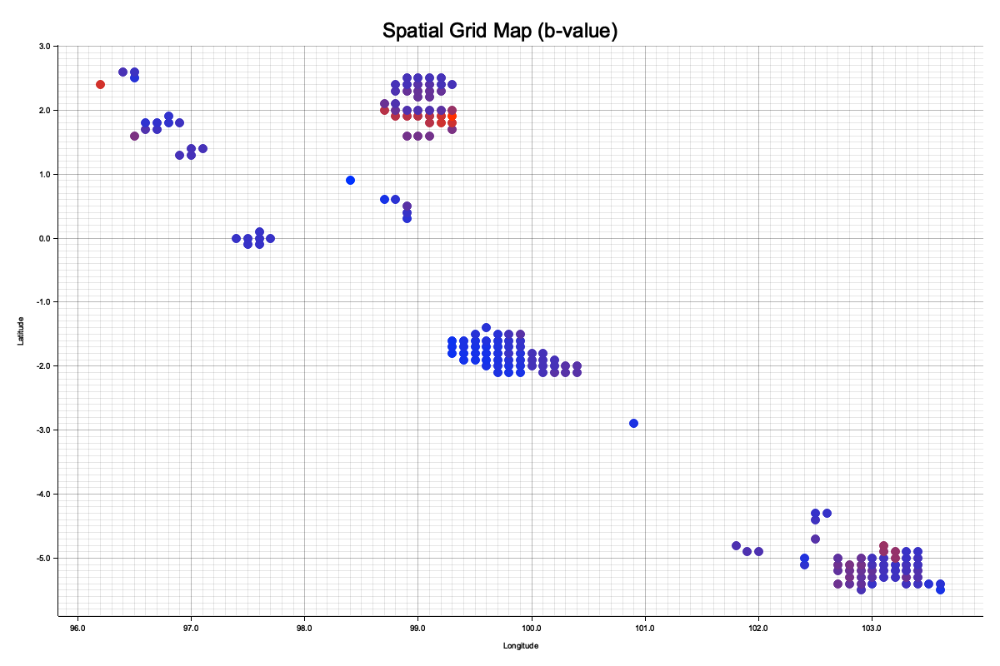
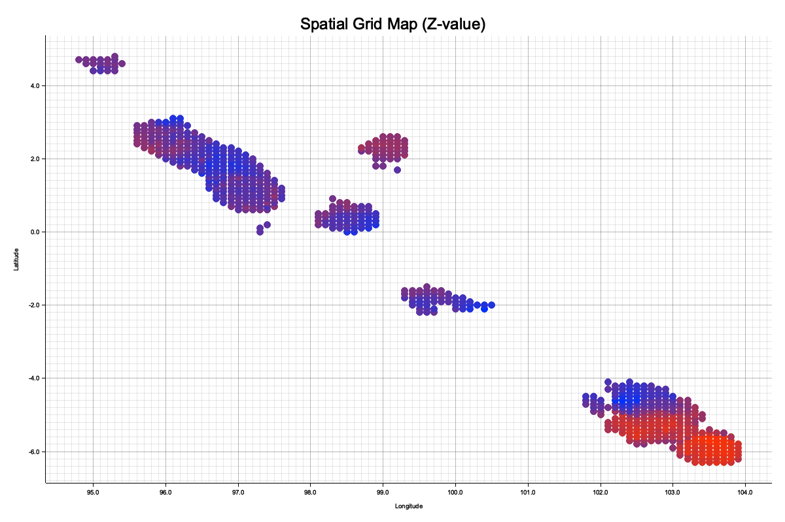

# SeisBox Stats Tutorial: Sumatra Case Study

Welcome to the SeisBox Statistical Seismology (`seisbox_stats`) tutorial. In this guide, we will walk through a complete end-to-end workflow using real seismicity data from the Sumatra subduction zone.

**Objective**: 
We will download raw catalog data, apply 3D subduction slab constraints, decluster the catalog, calculate baseline statistical models, and finally generate a spatial map of b-values.

**Requirements**:
Ensure that the `SeisPick` package is compiled and the executable `seisbox_stats` (and `seisbox_isc`) are accessible. We assume the commands are run from the project root directory.

---

## Step 1: Downloading Earthquake Data (`seisbox_isc`)
First, we acquire our dataset directly from the ISC (International Seismological Centre) Bulletin.
- **Bounds**: Lon: 95°E to 105°E, Lat: -6°S to 6°N (Sumatra Region)
- **Timeframe**: Jan 1, 2014 to Jan 1, 2015
- **Min Magnitude**: 3.0

```bash
./seisbox_isc download \
  --start-date 2014-01-01 --end-date 2015-01-01 \
  --min-lat -6.0 --max-lat 6.0 \
  --min-lon 95.0 --max-lon 105.0 \
  --min-mag 3.0 \
  --output sumatra_raw.csv
```

**Output**:
```text
[OUTPUT_1]
```

---

## Step 2: 3D Slab Geometry Filtering (`seisbox_stats filter`)
Subduction zones have complex 3D structures. To analyze the statistical properties of the megathrust itself, we want to exclude crustal and outer-rise earthquakes that don't conform to the slab. We use the Hayes (2018) Slab2 model (`sum_slab2_dep_02.23.18.xyz`).
- **Buffer**: We will retain any earthquake whose depth is within $\pm$ 20 km of the slab's depth at its epicenter.
- **Max Depth**: We limit it to 300 km.

```bash
./seisbox_stats filter --input sumatra_raw.csv \
  --slab-file ./Slab/sum_slab2_dep_02.23.18.xyz \
  --slab-buffer 20.0 \
  --max-depth 300.0 \
  --output sumatra_slab.csv
```

**Output**:
```text
SeisBox Stats — Filter
======================
Loaded 705 events from "sumatra_raw.csv"
Loading slab geometry from "./Slab/sum_slab2_dep_02.23.18.xyz"...
Loaded 115512 valid slab nodes. Filtering events...
Applied slab filter (buffer: 20 km).
Events after filtering: 372
Saved to "sumatra_slab.csv"
```

---

## Step 3: Declustering (`seisbox_stats decluster`)
Before calculating the background b-value, we must remove aftershocks to satisfy the assumption of Poissonian (independent) occurrence. We use the classic **Gardner & Knopoff (1974)** method combined with the **Uhrhammer (1986)** spatial window scaling.

```bash
./seisbox_stats decluster --input sumatra_slab.csv \
  --method gardner-knopoff \
  --window uhrhammer \
  --output sumatra_declustered.csv
```

**Output**:
```text
SeisBox Stats — Decluster
=========================
Loaded 372 events
Method: Gardner-Knopoff (window: Uhrhammer)
Result: 301 mainshocks, 71 aftershocks
Saved declustered catalogue to "sumatra_declustered.csv"
```

---

## Step 4: Statistical Distributions (`seisbox_stats plot`)
Now that we have an independent background catalog, let's visualize its properties.

### Frequency-Magnitude Distribution (FMD)
Calculates the Magnitude of Completeness (Mc), a-value, and b-value for the entire region.
```bash
./seisbox_stats plot \
  --input sumatra_declustered.csv \
  --plot-type fmd \
  --output fmd_plot.png
```
**Output**:
```text
SeisBox Stats — Plot Generation
================================
FMD plot saved to "fmd_plot.png"
```


### Cumulative Earthquake Number
Visualizes the stationarity of the seismic rate over time.
```bash
./seisbox_stats plot \
  --input sumatra_declustered.csv \
  --plot-type cumulative \
  --output cum_plot.png
```
**Output**:
```text
SeisBox Stats — Plot Generation
================================
Cumulative seismicity plot saved to "cum_plot.png"
```


---

## Step 5: Spatial Gridding of B-values (`seisbox_stats grid`)
We calculate the b-value continuously across the spatial domain using a constant radius approach. 
- **Radius**: 50 km.
- **Min Obs**: 50 events required per node.
- **Filter**: We apply the slab constraints again to ensure that any radius searches don't accidentally capture out-of-slab events.
- **Format**: We export a GeoTIFF (`--tiff`) for GIS software.

```bash
./seisbox_stats grid --input sumatra_declustered.csv \
  --method constant-r \
  --radius-km 50.0 \
  --min-events 50 \
  --param bvalue \
  --grid-inc 0.1 \
  --slab-file ./Slab/sum_slab2_dep_02.23.18.xyz \
  --slab-buffer 20.0 \
  --tiff \
  --output bvalue_grid.csv
```

**Output**:
```text
SeisBox Stats — Spatial Gridding
=================================
Loading slab geometry from "./Slab/sum_slab2_dep_02.23.18.xyz"...
Loaded 115512 valid slab nodes. Filtering events...
Applied slab filter (buffer: 20 km). Remaining events: 301
Grid bounds: Lon [94.00, 110.00], Lat [-9.00, 6.00]
Calculating grid points (this may take a while)...
Completed 0 grid nodes successfully.
Saved to "bvalue_grid.csv"
Exporting GeoTIFF...
Saved bvalue GeoTIFF to "bvalue_grid_bvalue.tif"
```
*(The generated `bvalue_grid.tif` can now be loaded directly into QGIS alongside the `sumatra_declustered.csv` catalog).*

We can quickly plot the spatial grid directly into a PNG image using the `plot-grid` command:

```bash
cargo run --release -p seisbox_stats --bin seisbox_stats -- plot-grid --input bvalue_grid.csv --output bvalue_grid_plot.png --param b-value --point-radius 5
```



---

## Step 6: Gutenberg-Richter Parameters (`seisbox_stats bvalue`)
Extract regional $a$-value, $b$-value, and $M_c$ directly without plotting.

```bash
./seisbox_stats bvalue --input sumatra_declustered.csv --method mle --bin-width 0.1
```

**Output**:
```text
SeisBox Stats — B-value Calculation
====================================
Loaded 301 events
Auto-estimated Mc = 4.70 (MAXC)
Method: Maximum Likelihood Estimation (Aki-Utsu)
Mc      = 4.70
b-value = 0.8562 ± 0.0876
a-value = 5.7566
N(>=Mc) = 54
```

---

## Step 7: Modified Omori Law Fitting (`seisbox_stats omori`)
Model the aftershock decay rate for a specific mainshock using Maximum Likelihood Estimation (MLE) to find parameters $p, c, K$. We use the largest event in our downloaded catalogue ($M_w$ 6.2 on Jan 25, 2014) as the mainshock.

```bash
./seisbox_stats omori --input sumatra_raw.csv \
  --mainshock-time "2014-01-25T05:14:20" \
  --max-days 100.0 \
  --min-mag 3.0
```

**Output**:
```text
SeisBox Stats — Omori Law Fitting
==================================
Omori Law Parameters (MLE):
k = 8.4784
c = 2.0500 days
p = 0.4000
Log-Likelihood = -75.6019
```

---

## Step 8: Z-value Mapping (`seisbox_stats grid`)
Measure seismic quiescence or activation by comparing seismicity rates between a background period ($T_1$) and a foreground period ($T_2$) using the LTA/STA Z-test.

```bash
./seisbox_stats grid --input sumatra_raw.csv \
  --method constant-r \
  --radius-km 50.0 \
  --min-events 10 \
  --param zvalue \
  --z-tw1 "2014-01-01/2014-06-01" \
  --z-tw2 "2014-06-02/2015-01-01" \
  --grid-inc 0.1 \
  --slab-file ./Slab/sum_slab2_dep_02.23.18.xyz \
  --slab-buffer 20.0 \
  --tiff \
  --output zvalue_grid.csv
```

**Output**:
```text
SeisBox Stats — Spatial Gridding
=================================
Loading slab geometry from "./Slab/sum_slab2_dep_02.23.18.xyz"...
Loaded 115512 valid slab nodes. Filtering events...
Applied slab filter (buffer: 20 km). Remaining events: 373
Grid bounds: Lon [94.00, 110.00], Lat [-9.00, 6.00]
Calculating grid points (this may take a while)...
Completed 680 grid nodes successfully.
Saved to "zvalue_grid.csv"
Exporting GeoTIFF...
Saved zvalue GeoTIFF to "zvalue_grid_zvalue.tif"
```
*(The generated `zvalue_grid.tif` highlights areas of rate increase (positive Z) and decrease (negative Z)).*

Similarly, we can plot the Z-value grid:

```bash
cargo run --release -p seisbox_stats --bin seisbox_stats -- plot-grid --input zvalue_grid.csv --output zvalue_grid_plot.png --param Z-value --point-radius 5
```


